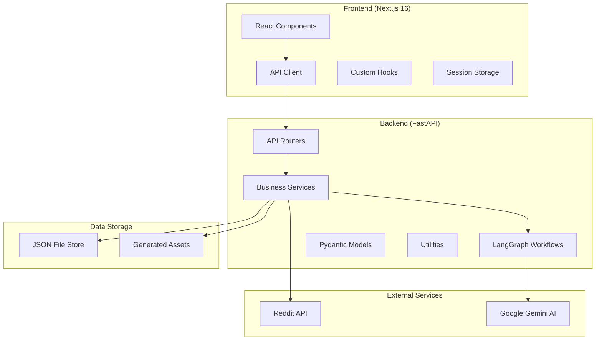
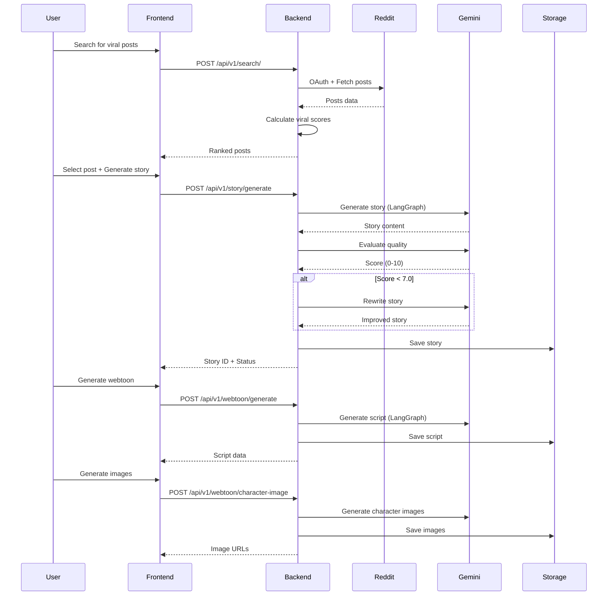
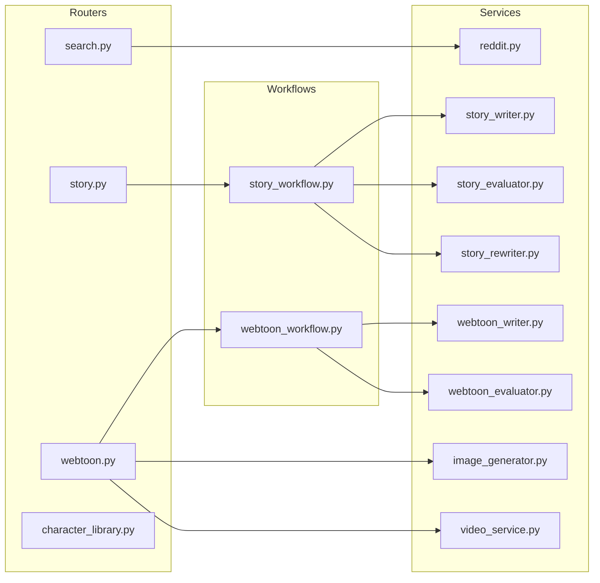

# Architecture Overview

## System Architecture



## Request Flow



## Module Dependency Graph



## Technology Stack

### Frontend
| Layer | Technology | Purpose |
|-------|------------|---------|
| Framework | Next.js 16 | React server components, App Router |
| UI Library | React 19 | Component rendering |
| Language | TypeScript 5.x | Type safety |
| Styling | TailwindCSS 4.x | Utility-first CSS |
| State | Session Storage + Hooks | Client-side persistence |

### Backend
| Layer | Technology | Purpose |
|-------|------------|---------|
| Framework | FastAPI 0.109 | Async API with OpenAPI |
| Server | Uvicorn 0.27 | ASGI server |
| Validation | Pydantic 2.5 | Data validation |
| AI Orchestration | LangGraph 0.0.20 | Workflow state machines |
| LLM Client | Google Generative AI | Gemini API |
| Storage | JSON Files | Lightweight persistence |

### External APIs
| Service | Purpose | Auth |
|---------|---------|------|
| Reddit API | Fetch viral posts | OAuth 2.0 |
| Google Gemini | Text/Image generation | API Key |

## Directory Structure

```
gossiptoon_v2_2/
├── backend/
│   ├── app/
│   │   ├── main.py              # FastAPI entry point
│   │   ├── config.py            # Settings (Pydantic)
│   │   ├── models/              # Data models
│   │   │   ├── search.py        # Search request/response
│   │   │   ├── story.py         # Story/Webtoon models
│   │   │   └── video_models.py  # Video generation
│   │   ├── routers/             # API endpoints
│   │   │   ├── search.py        # /api/v1/search/
│   │   │   ├── story.py         # /api/v1/story/
│   │   │   ├── webtoon.py       # /api/v1/webtoon/
│   │   │   └── character_library.py
│   │   ├── services/            # Business logic (12 modules)
│   │   ├── workflows/           # LangGraph definitions
│   │   ├── prompt/              # AI prompt templates
│   │   └── utils/               # Cache, persistence, etc.
│   └── data/                    # Generated JSON storage
├── viral-story-search/
│   ├── src/
│   │   ├── app/                 # Next.js pages
│   │   ├── components/          # React components (30+)
│   │   ├── hooks/               # Custom React hooks
│   │   ├── lib/                 # API client, constants
│   │   ├── types/               # TypeScript definitions
│   │   └── utils/               # Utility functions
│   └── public/                  # Static assets
└── .agent/workflows/            # This documentation
```

## Configuration

### Required Environment Variables
```env
# Reddit API (Required)
REDDIT_CLIENT_ID=xxx
REDDIT_CLIENT_SECRET=xxx

# Google Gemini (Required)
GOOGLE_API_KEY=xxx

# Optional
DEBUG=False
FRONTEND_URL=http://localhost:3000
GEMINI_MODEL=gemini-2.0-flash-exp
MODEL_IMAGE_GEN=gemini-2.5-flash-image
STORY_EVALUATION_THRESHOLD=7.0
STORY_MAX_REWRITES=2
```

### Ports
- Frontend: `http://localhost:3000`
- Backend: `http://localhost:8000`
- API Docs: `http://localhost:8000/docs`
