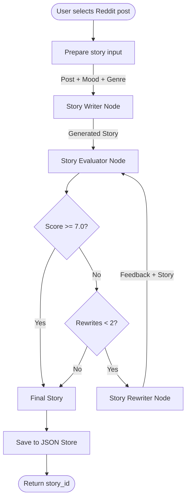
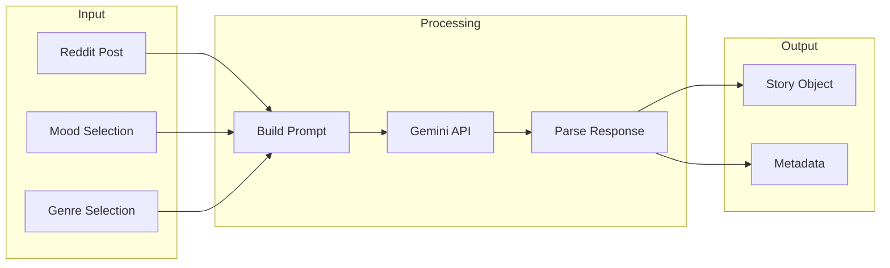

# Story Generation Workflow

## Intent

Transform a viral Reddit post into an engaging, reimagined story using AI. The workflow includes quality evaluation and iterative improvement to ensure output meets quality thresholds.

## Logic Flow



## Entry Point

**Router**: `backend/app/routers/story.py`
**Endpoint**: `POST /api/v1/story/generate`

```python
# Request
{
    "post_id": "abc123",
    "mood": "dramatic",      # Optional: dramatic, humorous, suspenseful, etc.
    "genre": "romance",      # Optional: romance, thriller, drama, etc.
    "options": {}            # Additional customization
}

# Response
{
    "workflow_id": "wf_xyz",
    "status": "pending"
}
```

## Workflow Implementation

**File**: `backend/app/workflows/story_workflow.py`

### State Schema
```python
class StoryWorkflowState(TypedDict):
    reddit_post: dict           # Original Reddit post data
    mood: str                   # Story mood preference
    genre: str                  # Story genre
    story: Optional[dict]       # Generated story
    evaluation: Optional[dict]  # Quality evaluation
    rewrite_count: int          # Number of rewrites attempted
    final_story: Optional[dict] # Final approved story
```

### Node Functions

1. **writer_node**: Calls `StoryWriter.generate_story()`
2. **evaluator_node**: Calls `StoryEvaluator.evaluate()`
3. **decision_node**: Checks score and rewrite count
4. **rewriter_node**: Calls `StoryRewriter.rewrite()`

## Service Dependencies

| Service | File | Purpose |
|---------|------|---------|
| StoryWriter | `services/story_writer.py` | Generate initial story from Reddit post |
| StoryEvaluator | `services/story_evaluator.py` | Score story quality (0-10) |
| StoryRewriter | `services/story_rewriter.py` | Improve story based on feedback |
| LLMConfig | `services/llm_config.py` | Configure Gemini prompts |

## AI Prompts

**Location**: `backend/app/prompt/`

| Prompt File | Purpose |
|-------------|---------|
| `story_writer.py` | System/user prompts for story generation |
| `story_evaluator.py` | Evaluation criteria and scoring rubric |
| `story_rewriter.py` | Rewrite instructions with feedback integration |

## Data Flow



## Output Schema

```python
class Story:
    id: str                     # Unique story ID
    title: str                  # Generated title
    content: str                # Full story text
    summary: str                # Brief summary
    original_post: dict         # Source Reddit post
    mood: str                   # Applied mood
    genre: str                  # Applied genre
    evaluation_score: float     # Final quality score
    rewrite_count: int          # Number of iterations
    created_at: datetime        # Generation timestamp
    metadata: dict              # Additional data
```

## Storage

**Location**: `backend/data/stories.json`

Stories are persisted as JSON with the story ID as the key.

## Gotchas / Edge Cases

1. **Rate Limiting**: Gemini API has rate limits. Multiple rapid requests may fail.

2. **Infinite Loops**: The `max_rewrites=2` setting prevents infinite evaluation loops when stories can't meet the 7.0 threshold.

3. **Long Posts**: Very long Reddit posts may exceed token limits. The story writer truncates content to fit.

4. **Empty Content**: Posts with only images/links have no text content. The writer uses the title and metadata instead.

5. **Evaluation Consistency**: LLM evaluation scores can vary between calls. The same story might get 6.8 one time and 7.2 the next.

6. **Workflow State**: If the server restarts mid-workflow, the state is lost. Workflows should be treated as ephemeral.

## Configuration

```python
# backend/app/config.py
STORY_EVALUATION_THRESHOLD = 7.0  # Minimum acceptable score
STORY_MAX_REWRITES = 2            # Maximum rewrite attempts
GEMINI_MODEL = "gemini-2.0-flash-exp"
```

## Example Usage

```bash
# 1. Start story generation
curl -X POST http://localhost:8000/api/v1/story/generate \
  -H "Content-Type: application/json" \
  -d '{"post_id": "abc123", "mood": "dramatic"}'

# Response: {"workflow_id": "wf_xyz", "status": "pending"}

# 2. Poll for completion
curl http://localhost:8000/api/v1/story/status/wf_xyz

# Response: {"status": "completed", "story_id": "story_456"}

# 3. Get final story
curl http://localhost:8000/api/v1/story/story_456
```
