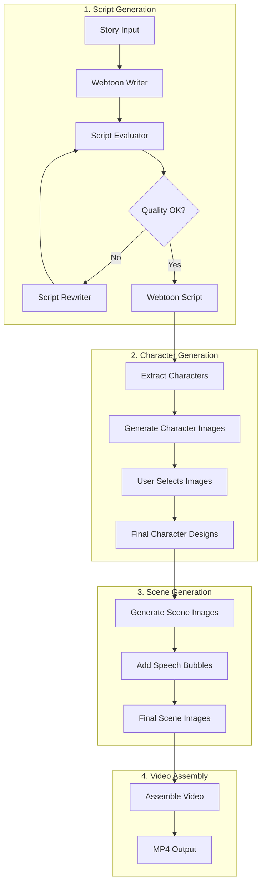
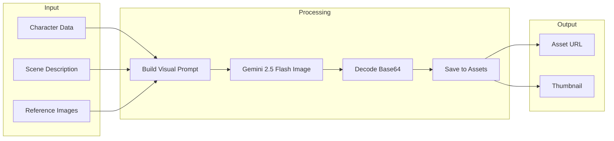
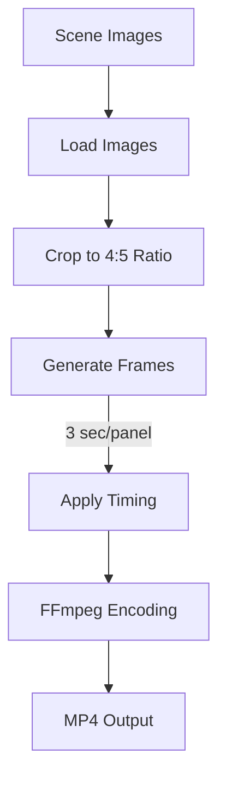

# Webtoon Generation Workflow

## Intent

Convert a generated story into a structured webtoon script with panels, dialogue, and character designs. Then generate visual assets (character images, scene images) and assemble them into a video.

## Complete Pipeline



## Entry Points

### Script Generation
**Endpoint**: `POST /api/v1/webtoon/generate`

```python
# Request
{
    "story_id": "story_456"
}

# Response
{
    "script_id": "script_789",
    "characters": [...],
    "panels": [...],
    "status": "completed"
}
```

### Character Image Generation
**Endpoint**: `POST /api/v1/webtoon/character-image`

```python
# Request
{
    "script_id": "script_789",
    "character_name": "John",
    "style": "webtoon"
}

# Response
{
    "images": [
        {"id": "img_001", "url": "/api/assets/...", "is_selected": false},
        {"id": "img_002", "url": "/api/assets/...", "is_selected": false}
    ]
}
```

### Scene Image Generation
**Endpoint**: `POST /api/v1/webtoon/scene-image`

```python
# Request
{
    "script_id": "script_789",
    "panel_number": 1,
    "style": "webtoon"
}

# Response
{
    "image": {"id": "scene_001", "url": "/api/assets/..."}
}
```

### Video Generation
**Endpoint**: `POST /api/v1/webtoon/video`

```python
# Request
{
    "script_id": "script_789"
}

# Response
{
    "video_url": "/api/assets/video_script_789.mp4"
}
```

## Workflow Implementation

**File**: `backend/app/workflows/webtoon_workflow.py`

### State Schema
```python
class WebtoonWorkflowState(TypedDict):
    story: dict                 # Source story
    script: Optional[dict]      # Generated script
    evaluation: Optional[dict]  # Quality evaluation
    rewrite_count: int          # Rewrite attempts
    final_script: Optional[dict]
```

## Service Dependencies

| Service | File | Purpose |
|---------|------|---------|
| WebtoonWriter | `services/webtoon_writer.py` | Generate script from story |
| WebtoonEvaluator | `services/webtoon_evaluator.py` | Validate script structure |
| WebtoonRewriter | `services/webtoon_rewriter.py` | Improve script quality |
| ImageGenerator | `services/image_generator.py` | Generate character/scene images |
| VideoService | `services/video_service.py` | Assemble video from assets |

## Script Structure

```python
class WebtoonScript:
    id: str
    story_id: str
    title: str
    genre: str
    characters: List[Character]  # Character definitions
    panels: List[Panel]          # Scene panels

class Character:
    name: str
    role: str                    # protagonist, antagonist, supporting
    age: str
    gender: str
    appearance: dict             # Visual description
    personality: str
    outfit: str
    reference_tag: str           # For image generation consistency

class Panel:
    panel_number: int
    scene_description: str
    characters_present: List[str]
    dialogue: List[DialogueLine]
    mood: str
    shot_type: str              # close-up, wide, medium
    composition_notes: str
```

## Image Generation Flow



## Video Assembly



### Video Specifications
- **Aspect Ratio**: 4:5 (vertical/mobile)
- **Resolution**: 1080x1350
- **Frame Rate**: 30 FPS
- **Duration**: 3 seconds per panel
- **Format**: MP4 (H.264)

## Storage Locations

| Data Type | Location |
|-----------|----------|
| Scripts | `backend/data/webtoon_scripts.json` |
| Character Images | `backend/app/assets/characters/` |
| Scene Images | `backend/app/assets/scenes/` |
| Videos | `backend/app/assets/videos/` |

## Gotchas / Edge Cases

1. **Complex Function**: `generate_scene_image()` in `webtoon.py` is 178 lines. Consider this when modifying scene generation logic.

2. **Character Consistency**: Reference images are used to maintain character appearance across scenes. If no reference is selected, results may be inconsistent.

3. **Panel Metadata**: The `_fill_missing_fields_in_dict()` function (186 lines) handles malformed LLM output. It has many fallback patterns for legacy field names.

4. **Image Selection**: Users must select character images before generating scenes. The selection pattern is duplicated between `select_character_image()` and `select_scene_image()`.

5. **FFmpeg Dependency**: Video generation requires FFmpeg installed on the system. The service will fail silently if FFmpeg is missing.

6. **Base64 Handling**: Image bytes may come as raw binary or base64. The code checks for PNG/JPEG magic bytes to determine format.

7. **Memory Usage**: Generating multiple scene images in sequence can consume significant memory. Consider batch limits.

## Configuration

```python
# Image generation
MODEL_IMAGE_GEN = "gemini-2.5-flash-image"

# Video settings
VIDEO_ASPECT_RATIO = (4, 5)  # Width:Height
VIDEO_RESOLUTION = (1080, 1350)
PANEL_DURATION_SECONDS = 3
VIDEO_FPS = 30
```

## Example Full Pipeline

```bash
# 1. Generate webtoon script
curl -X POST http://localhost:8000/api/v1/webtoon/generate \
  -d '{"story_id": "story_456"}'
# Returns: script_id

# 2. Generate character images (repeat for each character)
curl -X POST http://localhost:8000/api/v1/webtoon/character-image \
  -d '{"script_id": "script_789", "character_name": "John"}'

# 3. Select best character image
curl -X POST http://localhost:8000/api/v1/webtoon/character-image/select \
  -d '{"script_id": "script_789", "image_id": "img_002"}'

# 4. Generate scene images (repeat for each panel)
curl -X POST http://localhost:8000/api/v1/webtoon/scene-image \
  -d '{"script_id": "script_789", "panel_number": 1}'

# 5. Generate video
curl -X POST http://localhost:8000/api/v1/webtoon/video \
  -d '{"script_id": "script_789"}'
# Returns: video_url
```
