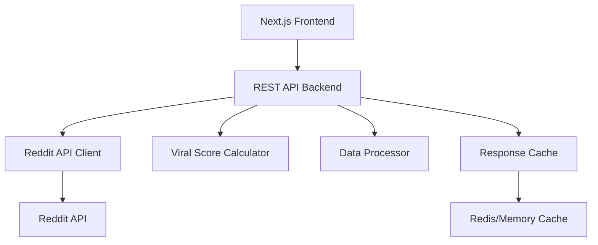
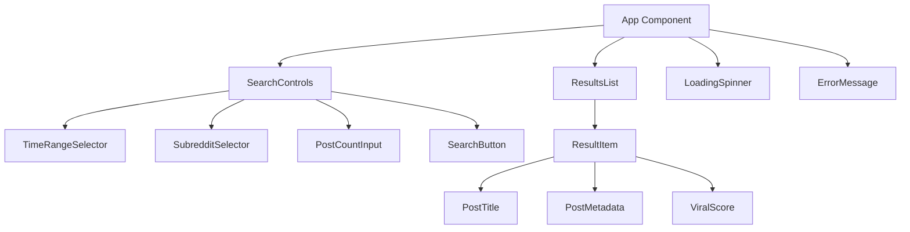

# Design Document

## Overview

The Viral Story Search system is a web application that discovers and ranks the most engaging Reddit stories across multiple subreddits within user-specified time ranges. The system uses a custom viral score algorithm to identify trending content and presents results through an intuitive React-based interface.

## Architecture

### System Architecture



### Component Architecture



## Components and Interfaces

### Frontend Components

#### SearchControls Component
```typescript
interface SearchControlsProps {
  onSearch: (criteria: SearchCriteria) => void;
  isLoading: boolean;
}

interface SearchCriteria {
  timeRange: '1h' | '7d' | '30d' | '100d';
  subreddits: string[];
  postCount: number;
}
```

#### TimeRangeSelector Component
```typescript
interface TimeRangeSelectorProps {
  selected: string;
  onChange: (range: string) => void;
  options: TimeRangeOption[];
}

interface TimeRangeOption {
  value: string;
  label: string;
  description: string;
}
```

#### SubredditSelector Component
```typescript
interface SubredditSelectorProps {
  selected: string[];
  onChange: (subreddits: string[]) => void;
  availableSubreddits: SubredditOption[];
}

interface SubredditOption {
  name: string;
  displayName: string;
  description: string;
  isPopular: boolean;
}
```

#### ResultsList Component
```typescript
interface ResultsListProps {
  posts: ViralPost[];
  searchCriteria: SearchCriteria;
  isLoading: boolean;
  error: string | null;
}

interface ViralPost {
  id: string;
  title: string;
  subreddit: string;
  url: string;
  upvotes: number;
  comments: number;
  viralScore: number;
  createdAt: Date;
  author: string;
}
```

### Backend API Interfaces

#### Search Endpoint
```typescript
// POST /api/search
interface SearchRequest {
  timeRange: string;
  subreddits: string[];
  postCount: number;
}

interface SearchResponse {
  posts: ViralPost[];
  totalFound: number;
  searchCriteria: SearchCriteria;
  executionTime: number;
}
```

#### Reddit API Client
```typescript
interface RedditApiClient {
  fetchPosts(subreddit: string, timeRange: string, limit: number): Promise<RedditPost[]>;
  validateSubreddit(name: string): Promise<boolean>;
}

interface RedditPost {
  id: string;
  title: string;
  subreddit: string;
  permalink: string;
  score: number;
  num_comments: number;
  created_utc: number;
  author: string;
  is_removed: boolean;
  is_deleted: boolean;
}
```

## Data Models

### Core Data Structures

```typescript
// Viral Score Calculation
interface ViralMetrics {
  upvotes: number;
  comments: number;
  hoursSincePosted: number;
  engagementRate: number;
}

// Search Configuration
interface SearchConfig {
  defaultTimeRange: string;
  defaultPostCount: number;
  maxPostCount: number;
  minUpvotes: number;
  minComments: number;
  cacheTimeout: number;
}

// Error Types
type ApiError = 
  | 'REDDIT_API_UNAVAILABLE'
  | 'RATE_LIMIT_EXCEEDED' 
  | 'NETWORK_ERROR'
  | 'INVALID_PARAMETERS'
  | 'TIMEOUT_ERROR';
```

### Database Schema (Optional Caching)

```sql
-- Optional: Cache popular searches
CREATE TABLE search_cache (
    id UUID PRIMARY KEY,
    search_hash VARCHAR(64) UNIQUE,
    criteria JSONB,
    results JSONB,
    created_at TIMESTAMP DEFAULT NOW(),
    expires_at TIMESTAMP
);

-- Optional: Track popular subreddits
CREATE TABLE subreddit_stats (
    name VARCHAR(50) PRIMARY KEY,
    display_name VARCHAR(100),
    subscriber_count INTEGER,
    is_active BOOLEAN DEFAULT TRUE,
    last_updated TIMESTAMP DEFAULT NOW()
);
```

## Viral Score Algorithm

### Core Formula

The viral score calculation prioritizes recent, highly-engaged content:

```typescript
function calculateViralScore(post: RedditPost): number {
  const upvotes = Math.max(0, post.score);
  const comments = post.num_comments;
  const hoursSincePosted = (Date.now() - post.created_utc * 1000) / (1000 * 60 * 60);
  
  // Base engagement score
  const engagementScore = upvotes + (comments * 2);
  
  // Time decay factor (newer posts get higher scores)
  const timeDecay = Math.max(1, hoursSincePosted + 1);
  
  // Viral score with time weighting
  const viralScore = engagementScore / timeDecay;
  
  return Math.round(viralScore * 100) / 100;
}
```

### Filtering Logic

```typescript
function isEligiblePost(post: RedditPost): boolean {
  return (
    post.score >= 10 &&
    post.num_comments >= 5 &&
    !post.is_removed &&
    !post.is_deleted &&
    post.title.length > 10
  );
}
```

### Ranking Algorithm

```typescript
function rankPosts(posts: RedditPost[]): ViralPost[] {
  return posts
    .filter(isEligiblePost)
    .map(post => ({
      ...post,
      viralScore: calculateViralScore(post)
    }))
    .sort((a, b) => b.viralScore - a.viralScore);
}
```

## User Interface Design

### Layout Structure

```
┌─────────────────────────────────────────────────────────────┐
│                    Viral Story Search                        │
├─────────────────────────────────────────────────────────────┤
│                                                             │
│  Time Range: [1d] [7d] [30d] [100d]                        │
│                                                             │
│  Subreddits:                                               │
│  ☑ r/AmItheAsshole    ☑ r/relationship_advice             │
│  ☑ r/tifu             ☐ r/confession                      │
│  ☑ r/pettyrevenge     ☐ r/maliciouscompliance             │
│                                                             │
│  Post Count: [20] posts                                     │
│                                                             │
│  [Search Viral Stories]                                     │
│                                                             │
├─────────────────────────────────────────────────────────────┤
│                        Results                              │
│                                                             │
│  1. AITA for telling my sister her boyfriend...            │
│     r/AmItheAsshole • Score: 847.3 • 2.1k ↑ • 456 💬      │
│                                                             │
│  2. TIFU by accidentally sending my boss...                │
│     r/tifu • Score: 723.8 • 1.8k ↑ • 234 💬               │
│                                                             │
│  3. My girlfriend broke up with me because...              │
│     r/relationship_advice • Score: 692.1 • 1.5k ↑ • 389 💬 │
│                                                             │
└─────────────────────────────────────────────────────────────┘
```

### Responsive Design

```css
/* Mobile-first responsive design */
.search-container {
  display: flex;
  flex-direction: column;
  gap: 1rem;
  padding: 1rem;
}

.time-range-selector {
  display: grid;
  grid-template-columns: repeat(auto-fit, minmax(80px, 1fr));
  gap: 0.5rem;
}

.subreddit-grid {
  display: grid;
  grid-template-columns: repeat(auto-fit, minmax(200px, 1fr));
  gap: 0.5rem;
}

.results-list {
  display: flex;
  flex-direction: column;
  gap: 1rem;
}

/* Desktop enhancements */
@media (min-width: 768px) {
  .search-container {
    max-width: 1200px;
    margin: 0 auto;
    padding: 2rem;
  }
  
  .subreddit-grid {
    grid-template-columns: repeat(3, 1fr);
  }
}
```

## Error Handling

### Error Classification

```typescript
enum ErrorType {
  REDDIT_API_ERROR = 'reddit_api_error',
  RATE_LIMIT = 'rate_limit',
  NETWORK_ERROR = 'network_error',
  VALIDATION_ERROR = 'validation_error',
  TIMEOUT_ERROR = 'timeout_error'
}

interface ErrorState {
  type: ErrorType;
  message: string;
  retryable: boolean;
  retryAfter?: number;
}
```

### Error Recovery Strategies

```typescript
class ErrorHandler {
  static handleApiError(error: any): ErrorState {
    if (error.status === 429) {
      return {
        type: ErrorType.RATE_LIMIT,
        message: 'Too many requests. Please wait before searching again.',
        retryable: true,
        retryAfter: 60
      };
    }
    
    if (error.status >= 500) {
      return {
        type: ErrorType.REDDIT_API_ERROR,
        message: 'Reddit service temporarily unavailable. Please try again.',
        retryable: true
      };
    }
    
    return {
      type: ErrorType.NETWORK_ERROR,
      message: 'Connection error. Please check your internet connection.',
      retryable: true
    };
  }
}
```

## Testing Strategy

### Unit Testing

Focus on core business logic and utility functions:

- Viral score calculation algorithm
- Post filtering and ranking logic
- Input validation functions
- Error handling utilities
- API response parsing

### Integration Testing

Test component interactions and API integration:

- Search flow from UI to results
- Reddit API client functionality
- Error state handling
- Cache behavior (if implemented)

### Property-Based Testing

Test universal properties that should hold across all inputs:

- Viral scores are always non-negative numbers
- Results are always sorted by viral score (descending)
- Filtered posts always meet minimum criteria
- Search parameters are properly validated

## Performance Considerations

### Optimization Strategies

```typescript
// 1. Request Debouncing
const debouncedSearch = useMemo(
  () => debounce(performSearch, 300),
  []
);

// 2. Result Caching
const searchCache = new Map<string, SearchResponse>();

function getCacheKey(criteria: SearchCriteria): string {
  return JSON.stringify(criteria);
}

// 3. Parallel API Requests
async function fetchAllSubreddits(subreddits: string[], criteria: SearchCriteria) {
  const promises = subreddits.map(sub => 
    redditApi.fetchPosts(sub, criteria.timeRange, criteria.postCount)
  );
  
  const results = await Promise.allSettled(promises);
  return results
    .filter(result => result.status === 'fulfilled')
    .flatMap(result => result.value);
}
```

### Caching Strategy

```typescript
interface CacheConfig {
  searchResultsTTL: number; // 5 minutes
  subredditDataTTL: number; // 1 hour
  maxCacheSize: number; // 100 entries
}

class SearchCache {
  private cache = new Map<string, CachedResult>();
  
  set(key: string, data: SearchResponse): void {
    if (this.cache.size >= this.config.maxCacheSize) {
      this.evictOldest();
    }
    
    this.cache.set(key, {
      data,
      timestamp: Date.now(),
      ttl: this.config.searchResultsTTL
    });
  }
  
  get(key: string): SearchResponse | null {
    const cached = this.cache.get(key);
    
    if (!cached || this.isExpired(cached)) {
      this.cache.delete(key);
      return null;
    }
    
    return cached.data;
  }
}
```

## Correctness Properties

*A property is a characteristic or behavior that should hold true across all valid executions of a system-essentially, a formal statement about what the system should do. Properties serve as the bridge between human-readable specifications and machine-verifiable correctness guarantees.*

Based on the prework analysis, the following properties must be validated through property-based testing:

### Property 1: Time Range Selection Persistence
*For any* time range selection, when a user selects a different time range, the system should update the active selection and use it for all subsequent searches until changed again.
**Validates: Requirements 1.2**

### Property 2: Time Range Change Clears Results
*For any* existing search results, when the time range is changed, the previous results should be cleared from the display.
**Validates: Requirements 1.4**

### Property 3: Subreddit Toggle Behavior
*For any* subreddit checkbox, clicking it should toggle its selection state and update the list of subreddits to be included in searches.
**Validates: Requirements 2.2**

### Property 4: Session Subreddit Persistence
*For any* subreddit selections made during a session, the selections should persist across different interactions until the session ends.
**Validates: Requirements 2.5**

### Property 5: Post Count Validation
*For any* post count input, the system should validate that the value is between 1 and 100, rejecting invalid values with appropriate error messages.
**Validates: Requirements 3.2**

### Property 6: Invalid Input Error Display
*For any* invalid post count input (negative, zero, or greater than 100), the system should display an error message and prevent search execution.
**Validates: Requirements 3.4**

### Property 7: Viral Score Calculation
*For any* post with upvotes, comments, and creation time, the viral score should be calculated as (upvotes + comments * 2) / (hours_since_posted + 1) and always return a non-negative number.
**Validates: Requirements 4.1**

### Property 8: Results Sorting by Viral Score
*For any* set of search results, the posts should be sorted in descending order by viral score, with the highest scoring post first.
**Validates: Requirements 4.2**

### Property 9: Post Filtering Criteria
*For any* post in the results, it should have at least 10 upvotes and 5 comments, and should not be marked as removed or deleted.
**Validates: Requirements 4.3, 4.4**

### Property 10: Search Execution with Valid Criteria
*For any* valid search criteria (selected subreddits, valid time range, valid post count), executing a search should fetch and display results from the specified subreddits.
**Validates: Requirements 5.1**

### Property 11: Loading State Display
*For any* search operation in progress, the system should display a loading indicator until the operation completes or fails.
**Validates: Requirements 5.2**

### Property 12: Successful Search Result Display
*For any* successful search completion, the system should display results sorted by viral score in the results area.
**Validates: Requirements 5.3**

### Property 13: API Error Handling
*For any* API error during search, the system should display an appropriate error message and provide a retry option.
**Validates: Requirements 5.4**

### Property 14: Result Item Information Completeness
*For any* displayed result item, it should contain post title, subreddit, viral score, upvotes, comments, and post age information.
**Validates: Requirements 6.1**

### Property 15: Post Title Link Behavior
*For any* post title in the results, clicking it should open the original Reddit post URL in a new browser tab.
**Validates: Requirements 6.2**

### Property 16: Search Criteria Display
*For any* search results displayed, the system should show the search criteria that were used to generate those results.
**Validates: Requirements 6.5**

### Property 17: User Interaction Visual Feedback
*For any* user interaction (button clicks, input changes, hover states), the system should provide appropriate visual feedback to indicate the interaction was registered.
**Validates: Requirements 7.5**

### Property 18: Validation Error Field Highlighting
*For any* invalid search parameters, the system should highlight the problematic input fields and display specific error messages.
**Validates: Requirements 8.4**

### Property 19: Recoverable Error Retry Option
*For any* recoverable error (network issues, API errors), the system should provide a "Try Again" button to allow users to retry the operation.
**Validates: Requirements 8.5**

## Testing Strategy

### Dual Testing Approach

The system will use both unit tests and property-based tests to ensure comprehensive coverage:

**Unit Tests** will verify:
- Specific examples and edge cases
- Component rendering with known inputs
- Error conditions with specific error types
- Integration between components
- Default values and initial states

**Property-Based Tests** will verify:
- Universal properties across all valid inputs
- Viral score calculation correctness with random inputs
- Sorting behavior with various result sets
- Input validation with boundary values
- State management across different user interactions

### Property-Based Testing Configuration

- **Testing Library**: fast-check (for TypeScript/JavaScript)
- **Minimum Iterations**: 100 per property test
- **Test Tagging**: Each property test must include a comment referencing the design property
- **Tag Format**: `// Feature: viral-story-search, Property {number}: {property_text}`

### Example Property Test Structure

```typescript
// Feature: viral-story-search, Property 7: Viral Score Calculation
test('viral score calculation property', () => {
  fc.assert(fc.property(
    fc.integer({ min: 0, max: 10000 }), // upvotes
    fc.integer({ min: 0, max: 1000 }),  // comments
    fc.integer({ min: 1, max: 8760 }),  // hours since posted
    (upvotes, comments, hours) => {
      const score = calculateViralScore({ upvotes, comments, hours });
      
      // Property: Score should always be non-negative
      expect(score).toBeGreaterThanOrEqual(0);
      
      // Property: Score should be finite
      expect(Number.isFinite(score)).toBe(true);
      
      // Property: More engagement should generally mean higher score (when time is constant)
      const higherEngagement = calculateViralScore({ 
        upvotes: upvotes + 100, 
        comments: comments + 50, 
        hours 
      });
      expect(higherEngagement).toBeGreaterThanOrEqual(score);
    }
  ));
});
```

### Testing Coverage Goals

- **Unit Test Coverage**: 90%+ for utility functions and components
- **Property Test Coverage**: All 19 correctness properties implemented
- **Integration Test Coverage**: Complete user workflows from search to results
- **Error Handling Coverage**: All error types and recovery scenarios