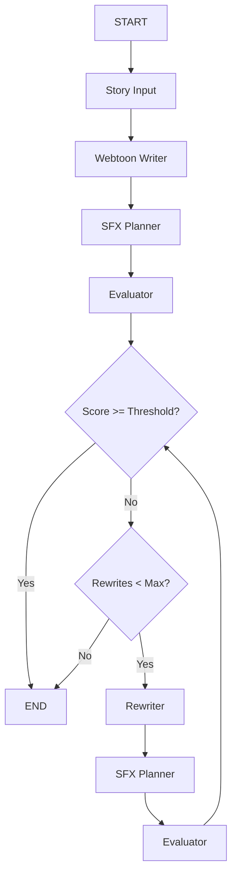

# Workflow Architecture Guide

This document explains the webtoon generation workflow architecture in Gossiptoon V2.

## Overview

The application uses **LangGraph** for orchestrating complex AI workflows that transform Reddit stories into webtoon content. The current architecture is a **monolithic workflow** with evaluation and rewriting capabilities.

## Current Workflow: `webtoon_workflow.py`

### Architecture Pattern
- **Monolithic Design**: Single workflow handling all generation steps
- **Evaluation Loop**: Automatic quality assessment and conditional rewriting
- **State Management**: Centralized state tracking through `WebtoonWorkflowState`

### Workflow Flow



### Key Components

#### 1. WebtoonWorkflowState
```python
class WebtoonWorkflowState(TypedDict):
    story: str                    # Input story text
    story_genre: str             # Genre classification
    image_style: str             # Visual style preference
    webtoon_script: Optional[dict] # Generated script
    evaluation_score: float      # Quality score (0-10)
    evaluation_feedback: str     # Feedback for improvements
    rewrite_count: int          # Number of rewrites performed
    current_step: str           # Current workflow step
    error: Optional[str]        # Error message if any
```

#### 2. Workflow Nodes

| Node | Purpose | Input | Output |
|------|---------|-------|--------|
| `webtoon_writer_node` | Generate initial script | Story + Genre | WebtoonScript |
| `sfx_planner_node` | Add visual effects | WebtoonScript | Enhanced script |
| `evaluator_node` | Assess quality | WebtoonScript | Score + Feedback |
| `rewriter_node` | Improve script | Script + Feedback | Improved script |

#### 3. Conditional Routing

The workflow uses intelligent routing based on evaluation scores:

```python
def should_rewrite(state: WebtoonWorkflowState) -> Literal["rewrite", "end"]:
    score = state.get("evaluation_score", 0)
    rewrite_count = state.get("rewrite_count", 0)
    
    # High quality - finish
    if score >= settings.evaluation_threshold:
        return "end"
    
    # Max rewrites reached - finish
    if rewrite_count >= settings.max_rewrites:
        return "end"
    
    # Low quality and can rewrite - continue
    return "rewrite"
```

### Configuration

Key settings in `backend/app/config.py`:

```python
class Settings(BaseSettings):
    evaluation_threshold: float = 7.0  # Minimum acceptable score
    max_rewrites: int = 2             # Maximum rewrite attempts
    enable_sfx_planning: bool = True   # Enable SFX enhancement
```

## Usage Examples

### Basic Workflow Execution

```python
from app.workflows.webtoon_workflow import run_webtoon_workflow

# Execute workflow
result = await run_webtoon_workflow(
    story="A young woman discovers...",
    story_genre="MODERN_ROMANCE_DRAMA",
    image_style="SOFT_ROMANTIC_WEBTOON"
)

# Access results
script = result["webtoon_script"]
final_score = result["evaluation_score"]
```

### API Integration

The workflow is integrated into the REST API at `/api/v1/webtoon/`:

```python
# In backend/app/routers/webtoon.py
webtoon_script = await run_webtoon_workflow(
    story=story_content,
    story_genre=request.genre,
    image_style=request.image_style
)
```

## Quality Assurance

### Evaluation Criteria

The evaluator assesses scripts on multiple dimensions:

1. **Story Structure** (0-10): Plot coherence, pacing, character development
2. **Visual Adaptation** (0-10): Scene descriptions, panel composition
3. **Dialogue Quality** (0-10): Natural conversation, emotional impact
4. **Genre Consistency** (0-10): Adherence to genre conventions

### Automatic Rewriting

When scores fall below the threshold:

1. **Feedback Generation**: Specific improvement suggestions
2. **Targeted Rewriting**: Focus on identified weaknesses
3. **Re-evaluation**: Quality check on improved version
4. **Iteration Control**: Maximum 2 rewrites to prevent infinite loops

## Performance Considerations

### Caching Strategy
- **Script Caching**: Generated scripts cached by story hash
- **Evaluation Caching**: Scores cached to avoid re-evaluation
- **TTL Management**: 5-minute cache expiration for development

### Error Handling
- **Graceful Degradation**: Continue with lower-quality output if rewriting fails
- **State Preservation**: Maintain partial results for debugging
- **Timeout Protection**: Workflow timeouts prevent hanging

## Monitoring and Debugging

### Logging
```python
logger.info(f"Workflow started for story: {story[:50]}...")
logger.info(f"Evaluation score: {score}/10")
logger.warning(f"Rewrite attempt {rewrite_count}/{max_rewrites}")
```

### State Inspection
```python
# Check workflow state at any point
current_state = workflow.get_state()
print(f"Current step: {current_state['current_step']}")
print(f"Score: {current_state['evaluation_score']}")
```

## Future Architecture Considerations

### Planned Enhancements

1. **Modular Agent System**: Break workflow into specialized agents
2. **Parallel Processing**: Concurrent character and scene generation
3. **Multi-Model Support**: Support for different LLM providers
4. **Advanced Routing**: More sophisticated conditional logic

### Migration Path

When upgrading to a modular architecture:

1. **Backward Compatibility**: Maintain current API contracts
2. **Gradual Migration**: Phase in new components
3. **A/B Testing**: Compare workflow performance
4. **State Migration**: Convert existing state formats

## Best Practices

### Workflow Design
- **Single Responsibility**: Each node has one clear purpose
- **Stateless Nodes**: Nodes don't maintain internal state
- **Error Boundaries**: Proper exception handling in each node
- **Idempotency**: Nodes can be safely retried

### Performance Optimization
- **Lazy Loading**: Load models only when needed
- **Batch Processing**: Group similar operations
- **Resource Cleanup**: Properly dispose of resources
- **Memory Management**: Monitor memory usage in long workflows

### Testing Strategy
- **Unit Tests**: Test individual nodes in isolation
- **Integration Tests**: Test complete workflow execution
- **Property Tests**: Verify workflow invariants
- **Performance Tests**: Monitor execution time and resource usage

## Troubleshooting

### Common Issues

#### Workflow Hangs
- Check for infinite loops in conditional routing
- Verify timeout settings
- Monitor resource usage

#### Low Quality Scores
- Review evaluation criteria
- Check prompt templates
- Validate input story quality

#### Memory Issues
- Monitor state size growth
- Implement state cleanup
- Use streaming for large outputs

### Debug Commands

```bash
# Enable debug logging
export DEBUG=True

# Run with verbose output
uvicorn app.main:app --log-level debug

# Monitor workflow execution
tail -f logs/workflow.log
```

## Related Documentation

- [API Reference](../README.md#api-endpoints)
- [Configuration Guide](../app/config.py)
- [Testing Guide](../tests/README.md)
- [Deployment Guide](DEPLOYMENT.md)