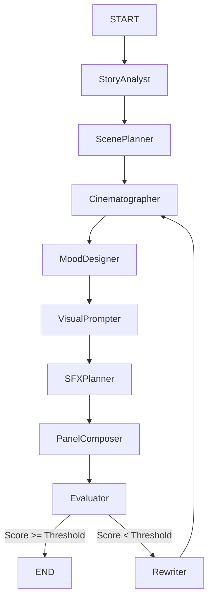

# Enhanced Webtoon Workflow Documentation

## Overview

This document describes the **Enhanced Webtoon Generation Workflow** (v2.0.0 Phase 4), which orchestrates multiple specialized AI agents using **LangGraph**.
It transforms a raw textual story into a fully structured, visual-ready webtoon script with rich metadata (mood, shots, sfx).

**Workflow Type:** `StateGraph` (LangGraph)
**Entry Point:** `story_analyst`
**Success End State:** `END` (after passing evaluation)

---

## 1. Global State Schema

The workflow maintains a shared state object (`EnhancedWebtoonState`) passed between all nodes.

```json
{
  "story": "string (Input story text)",
  "story_genre": "string (e.g., MODERN_ROMANCE_DRAMA)",
  "image_style": "string (e.g., SOFT_ROMANTIC_WEBTOON)",
  "webtoon_script": "dict (Serialized WebtoonScript object)",
  "characters": "List[dict] (Character definitions)",
  "panels": "List[dict] (Panel definitions)",
  "scene_plan": "dict (Metadata from scene planner)",
  "shot_plan": "dict (Output from Cinematographer)",
  "mood_assignments": "List[dict] (Output from Mood Designer)",
  "enhanced_prompts": "List[string] (Output from Visual Prompter)",
  "sfx_plan": "dict (Output from SFX Planner)",
  "page_groupings": "List[dict] (Output from Panel Composer)",
  "evaluation_score": "float (0-10)",
  "evaluation_feedback": "string",
  "evaluation_issues": "List[string]",
  "rewrite_count": "integer",
  "current_step": "string",
  "error": "string | null"
}
```

---

## 2. Workflow Nodes (Agents)

### Node 1: Story Analyst (`story_analyst`)

- **Responsibility**: Analyzes the input story to identify scenes, key plot points, and character traits.
- **Source**: `app/agents/story_analyst.py`
- **Input**: `state.story`
- **Output**: `state.story_analysis`
- **Prompt**: _Currently placeholder logic (splits by paragraphs) to be replaced by LLM analysis._

### Node 2: Scene Planner (`scene_planner`)

- **Responsibility**: Structures the story into discrete visual beats/panels.
- **Source**: `app/agents/scene_planner.py` (Delegates to `webtoon_writer`)
- **Prompt**: Uses `WEBTOON_WRITER_PROMPT` (v13) from `app/prompt/webtoon_writer.py`.
  - **Key Instruction**: "Convert story into 12-17 scenes. Identify 'Impact' moments vs 'Bridge' moments."
  - **Enforces**: Show-don't-tell dialogue, no internal monologue.
- **Input**: `state.story`, `state.story_genre`, `state.image_style`
- **Output**: `state.webtoon_script`, `state.panels`, `state.characters`

### Node 3: Cinematographer (`cinematographer`)

- **Responsibility**: Optimizes shot composition, angles, and framing.
- **Source**: `app/agents/cinematographer.py`
- **Prompt**: Uses `CINEMATOGRAPHER_SYSTEM_PROMPT` from `app/prompt/cinematographer.py`.
  - **Key Instruction**: "Assign shot types (Extreme Close-up, Wide, etc.) and Angles (Dutch, Low, High). Ensure variety (no 2 consecutive same shots)."
- **Input**: `state.panels` (JSON list)
- **Output**: `state.shot_plan` (JSON object with shot details per panel)

### Node 4: Mood Designer (`mood_designer`)

- **Responsibility**: Assigns emotional color grading and lighting functionality.
- **Source**: `app/agents/mood_designer.py`
- **Prompt**: Uses `MOOD_DESIGNER_SYSTEM_PROMPT` from `app/prompt/mood_designer.py`.
  - **Key Instruction**: "Determine Color Temperature (warm/cool), Saturation, Lighting Mood (dramatic/soft), and Special Effects (sparkles/rain) for each panel based on emotion."
- **Input**: `state.panels`
- **Output**: `state.mood_assignments` (List of mood settings per panel)

### Node 5: Visual Prompter (`visual_prompter`)

- **Responsibility**: Fuses the panel description, styles, and mood into the final GenAI image prompt.
- **Source**: `app/agents/visual_prompter.py`
- **Logic**: Python logic (not LLM-based) that combines `webtoon_writer` visual prompt + `image_style` + `mood_designer` output to create a composite prompt string.
- **Input**: `state.panels`, `state.mood_assignments`
- **Output**: `state.enhanced_prompts` (Final strings sent to Image Gen)

### Node 6: SFX Planner (`sfx_planner`)

- **Responsibility**: Plans onomatopoeia and visual effects text.
- **Source**: `app/agents/sfx_planner.py`
- **Prompt**: Uses `SFX_PLANNER_SYSTEM_PROMPT` from `app/prompt/sfx_planner.py`.
  - **Key Instruction**: "Suggest Impact Text (BANG!), Motion Effects (speed lines), and Emotional Effects (sweat drops) based on panel intensity."
- **Input**: `state.panels`
- **Output**: `state.sfx_plan`

### Node 7: Panel Composer (`panel_composer`)

- **Responsibility**: Groups individual panels into vertical "pages" or strips for final composition.
- **Source**: `app/agents/panel_composer.py`
- **Logic**: Algorithmic grouping (1-3 panels per page) based on statistics.
- **Input**: `state.panels`
- **Output**: `state.page_groupings`

### Node 8: Evaluator (`evaluator`)

- **Responsibility**: Quality assurance loop.
- **Source**: `app/workflows/enhanced_webtoon_workflow.py` -> `webtoon_evaluator`
- **Logic**: Checks if script meets criteria (dialogue count, panel count, image quality).
- **Input**: `state.webtoon_script`
- **Output**: `state.evaluation_score`, `state.evaluation_issues`, `state.target_agent` (which agent failed).
- **Routing**:
  - If `score < threshold`: Go to `rewriter`.
  - If `score >= threshold`: Go to `END`.

### Node 9: Rewriter (`rewriter`)

- **Responsibility**: Fixes issues identified by the evaluator.
- **Source**: `app/services/webtoon_rewriter.py`
- **Prompt**: Uses `WEBTOON_REWRITER_PROMPT` from `app/services/webtoon_rewriter.py`.
  - **Key Instruction**: "Rewrite the webtoon script to address specific feedback (add scenes, fix dialogue) while maintaining character consistency."
- **Input**: `state.webtoon_script`, `state.evaluation_feedback`, `state.target_agent`
- **Output**: `state.webtoon_script` (Updated)
- **Next Step**: Loop back to `cinematographer` (to re-analyze the new script).

---

## 3. Execution Graph

The following directed graph represents the execution flow:



---

## 4. Prompt Dependencies

| Node              | Primary Prompt File                | Job Description                                           |
| ----------------- | ---------------------------------- | --------------------------------------------------------- |
| `Story Analyst`   | `app/agents/story_analyst.py`      | (Logic) Split story into scenes                           |
| `Scene Planner`   | `app/prompt/webtoon_writer.py`     | **Story & Dialogue**: Convert prose to visual script      |
| `Cinematographer` | `app/prompt/cinematographer.py`    | **Camera & Framing**: Plan shots usage (Close-up vs Wide) |
| `Mood Designer`   | `app/prompt/mood_designer.py`      | **Color & Lighting**: Assign emotional color grading      |
| `Visual Prompter` | `app/agents/visual_prompter.py`    | (Logic) Merge prompts + style tokens                      |
| `SFX Planner`     | `app/prompt/sfx_planner.py`        | **Effects**: Suggest text effects & motion lines          |
| `Rewriter`        | `app/services/webtoon_rewriter.py` | **Correction**: Fix identified script flaws               |

---

## 5. Agent Handoff Protocol

Each agent in the chain receives the **Global State**, reads the output of previous agents, and appends its specific output.

**Example Handoff:**

1. **Scene Planner** creates `webtoon_script` with `panels` (basic description).
2. **Cinematographer** reads `panels`, analyzes them, and creates `shot_plan`.
3. **Mood Designer** reads `panels` + `shot_plan`, determines emotion, creates `mood_assignments`.
4. **Visual Prompter** reads `panels` + `mood_assignments`, composites the final string for image generation.
5. **SFX Planner** reads `panels` (text/action), creates `sfx_plan` for post-processing overlay.

This additive process ensures that downstream agents are "aware" of upstream decisions without needing to re-process the raw story.
