# GossipToon V2: Complete System Design Document

**Version:** 2.0.0  
**Date:** 2025-01-14  
**Status:** Design Phase - Ready for Implementation

---

## 📋 Table of Contents

1. [Executive Summary](#executive-summary)
2. [Core Problems & Solutions](#core-problems--solutions)
3. [System Architecture](#system-architecture)
4. [Visual Storytelling System](#visual-storytelling-system)
5. [Character Consistency System](#character-consistency-system)
6. [Quality Assurance System](#quality-assurance-system)
7. [User Interface Design](#user-interface-design)
8. [Complete Workflow](#complete-workflow)
9. [Technical Implementation](#technical-implementation)
10. [Cost & Performance Analysis](#cost--performance-analysis)

---

## 1. Executive Summary

### 1.1 Project Vision

Transform Reddit stories into **visually-led webtoon-style vertical videos** (YouTube Shorts format) that prioritize:
- **Visual storytelling** over narration
- **Character consistency** throughout
- **Attractive character design** even in mundane stories
- **Human-in-the-loop** for quality control
- **Efficient iteration** with AI assistance

### 1.2 Key Innovations

| Innovation | Problem Solved | Method |
|------------|----------------|--------|
| **Visual Beat System** | Boring, narrator-heavy videos | Story → Visual Moments conversion |
| **Mute Test** | Images don't tell story | AI validates visual clarity |
| **Model Sheet + Hero Shot** | Character inconsistency | Dual reference system |
| **Progressive Refinement** | Validation failures | Auto-fix → Manual edit → Strict retry |
| **Hybrid Automation** | Full automation impossible | Strategic human checkpoints |

### 1.3 Output Format

- **Format:** Vertical scrolling video (9:16)
- **Duration:** 30-60 seconds
- **Content:** 8-12 static images with scroll transitions
- **Enhancement:** 2-3 key scenes with subtle animation
- **Audio:** Minimal narration (30s max) + speech bubbles + BGM
- **Style:** Modern Korean webtoon aesthetic with attractive characters

---

## 2. Core Problems & Solutions

### 2.1 Problem 1: Narrator-Heavy Content

#### **Problem Description:**
```
Current Flow:
Reddit Story → AI Expansion → Long Narration → Boring Static Images

Issues:
- AI expands story too much (300 → 500 words)
- Narration takes 60+ seconds
- Images stay static while narration plays
- Viewer gets bored, confused
```

#### **Solution: Visual Beat System**

Convert story into **discrete visual moments** that can be shown without narration:

```python
# Story Analysis
Reddit Story (plain text)
    ↓
Extract Visual Beats (AI)
    ↓
8-12 Visual Moments
    ↓
Each Beat has:
  - Type: DETAIL | ACTION | REACTION
  - Visual Focus: What to show
  - Camera Angle: How to show
  - Evidence: Physical object/action
  - Emotional Tone: Mood
```

**Visual Beat Types (40/40/20 distribution):**

1. **DETAIL SHOT (40%)** - Show Evidence
   ```
   Purpose: Physical proof of what happened
   Examples:
   - Lipstick in car
   - Text message on phone
   - Wedding ring on table
   - Torn photo
   
   Camera: Extreme closeup, shallow depth
   ```

2. **ACTION SHOT (40%)** - Show What's Happening
   ```
   Purpose: Dynamic moments, key events
   Examples:
   - Throwing wine glass
   - Slamming door
   - Reaching for object
   - Running away
   
   Camera: Mid-action, motion blur
   ```

3. **REACTION SHOT (20%)** - Show Emotion
   ```
   Purpose: Character's emotional response
   Examples:
   - Eyes widening in shock
   - Tears streaming
   - Jaw clenching in anger
   - Blank stare
   
   Camera: Closeup on face, focus on eyes
   ```

**Mute Test Validation:**

AI validates if story is understandable **without audio**:

```python
def mute_test(visual_beats: List[VisualBeat]) -> float:
    """
    AI analyzes: "Can you understand the story from images alone?"
    
    Scoring:
    10: Perfect clarity
    7: General flow clear
    4: Confusing
    1: No idea
    
    Pass Threshold: >= 7.0
    """
    prompt = f"""
    Given these image descriptions, tell the story:
    {visual_beats}
    
    Score 1-10: Can you understand what happened?
    """
    return ai.evaluate(prompt)
```

---

### 2.2 Problem 2: Character Inconsistency

#### **Problem Description:**
```
Scene 1: Sarah - long brown hair, blue dress
Scene 5: Sarah - short blonde hair, red jacket (???)

OR

Prompt: "char_1 crying, char_2 walking away"
Result: char_1 walking, char_2 crying (SWAPPED!)
```

#### **Solution: Dual Reference System**

**A. Model Sheet (Technical Reference)**
```
Purpose: Consistency baseline
Content: 3-view character sheet (Front/Side/3-4)
Style: Clean, technical, neutral
Features:
- Neutral expression
- Simple outfit (white shirt, jeans)
- White background
- All distinctive features visible

Usage: Consistency validation, feature checklist
```

**B. Hero Shot (Usable Reference)**
```
Purpose: Actual scene generation
Content: Single attractive character portrait
Style: Fashionable, appealing, dynamic
Features:
- Trendy outfit
- Confident pose
- Flattering lighting
- Modern styling

Usage: Multimodal reference for scene generation
```

**Character Profile Structure:**
```python
class CharacterProfile:
    id: str  # "char_1"
    name: str  # "Sarah"
    role: str  # "protagonist"
    
    # Permanent Features (NEVER change)
    permanent_features: {
        "face": "oval face, brown eyes, high cheekbones",
        "hair": "shoulder-length wavy brown hair",
        "body": "average height, slim build",
        "distinctive": "small mole above left lip, wears glasses"
    }
    
    # Fashion Style (changes per scene context)
    fashion_style: str  # "Modern casual chic"
    
    # References
    model_sheet: Image  # 3-view technical
    hero_shot: Image    # Attractive usable
    
    # Metadata
    story_importance: str  # "main character, POV"
    personality: str       # "betrayed wife, initially trusting"
```

**Character Reuse Strategy:**
```
1 Reference Set per Character per Story
- Model Sheet: Generated once, used for validation
- Hero Shot: Generated once, used for all scenes
- Clothing variations: Only if story requires (re-generate Hero Shot)
```

---

### 2.3 Problem 3: Plain/Boring Images

#### **Problem Description:**
```
Story: "I saw my ex at Costco"
Current Output: Two people standing in aisle, neutral expressions

Issues:
- Characters look generic
- No visual appeal
- Boring compositions
- Nothing interesting to look at
```

#### **Solution: Attractive Character Design System**

**Core Principle:** Even mundane stories deserve visually appealing characters.

**Visual Appeal Guidelines:**
```python
VISUAL_APPEAL_BOOST = """
MANDATORY for ALL characters:

1. FASHION (40% of appeal):
   ✓ Well-fitted, modern clothing
   ✓ Color coordination
   ✓ Trendy style appropriate to role
   ✓ Clean, polished appearance
   
   Examples:
   - Office worker: Blazer + fitted pants + clean shoes
   - Casual scene: Stylish sweater + jeans + ankle boots
   - Home scene: Comfortable but cute loungewear

2. GROOMING (30% of appeal):
   ✓ Styled hair (not messy unless intentional)
   ✓ Clear, glowing skin
   ✓ Well-maintained appearance
   
3. POSTURE & POSE (20% of appeal):
   ✓ Confident body language
   ✓ Dynamic angles (not stiff)
   ✓ Natural but flattering poses

4. ACCESSORIES (10% of appeal):
   ✓ 2-3 subtle accessories
   ✓ Adds personality
   ✓ Not overwhelming
   
   Examples: Watch, earrings, bag, scarf

5. LIGHTING:
   ✓ Soft, flattering light
   ✓ Highlights features
   ✓ Professional quality
"""
```

**Fashion Style by Role:**
```python
ROLE_FASHION_STYLES = {
    "protagonist": "Modern casual chic - fitted jeans, stylish top, clean sneakers",
    "antagonist": "Sharp business casual - blazer, dark colors, sophisticated",
    "love_interest": "Romantic casual - soft colors, flowing fabrics, delicate accessories",
    "friend": "Trendy streetwear - oversized hoodie, cap, statement pieces",
    "authority": "Professional elegant - suit/dress, polished, commanding presence"
}
```

**Example Transformation:**

```
Story: "I ran into my ex at Costco"

Before (Boring):
- Character: Generic 30s woman
- Outfit: Plain t-shirt, jeans
- Pose: Standing, neutral
- Result: Forgettable

After (Attractive):
- Character: Stylish 30s woman
- Outfit: Fitted knit sweater, well-fitted jeans, ankle boots, crossbody bag
- Hair: Styled bob with subtle waves
- Accessories: Small earrings, watch
- Pose: Pushing cart with elegant posture, slight turn toward camera
- Lighting: Soft, flattering
- Result: "Wow, she looks put-together even at Costco!"
```

---

### 2.4 Problem 4: Character Swap/Confusion

#### **Problem Description:**
```
Scene Prompt: "char_1 crying, char_2 walking away"
Generated Image: char_1 walking away, char_2 crying

Causes:
- AI doesn't track character identity
- Generic descriptions ("a woman crying")
- No spatial constraints
- No visual markers
```

#### **Solution: Multi-Layer Identity System**

**A. Visual Markers**
```python
class CharacterIdentity:
    # Permanent markers (always visible)
    distinctive_features: [
        "small mole above left lip",
        "wears round glasses"
    ]
    
    # Scene markers (outfit-based)
    visual_markers: {
        "primary_color": "Red",  # Red scarf, jacket, etc.
        "signature_item": "Red scarf (always wearing)"
    }
    
    # Spatial markers
    default_position: "left"  # Character tends to appear on left
```

**B. Position Locking**
```python
class SpatialConstraints:
    def lock_character_positions(self, scene: Scene):
        """
        Assign fixed spatial positions per character
        """
        positions = {
            2: ["LEFT half", "RIGHT half"],
            3: ["LEFT third", "CENTER", "RIGHT third"]
        }
        
        for char, position in zip(scene.characters, positions[len(scene.characters)]):
            char.locked_position = position
```

**C. Action-Character Binding**
```python
class ActionBinder:
    def bind_actions(self, scene: Scene):
        """
        Explicitly map action to character ID
        """
        return [
            {
                "character_id": "char_1",
                "character_name": "Sarah",
                "primary_action": "crying",
                "body_position": "sitting on bed",
                "facing": "camera",
                "spatial_zone": "LEFT"
            },
            {
                "character_id": "char_2",
                "character_name": "Jake",
                "primary_action": "walking",
                "body_position": "doorway",
                "facing": "away from camera",
                "spatial_zone": "RIGHT"
            }
        ]
```

**D. Validation (Post-Generation)**
```python
class SwapDetector:
    def detect_swap(self, image: Image, expected: Dict) -> bool:
        """
        Use Vision AI to verify character actions
        """
        prompt = f"""
        Expected:
        - LEFT side: Character with red scarf should be crying
        - RIGHT side: Character with blue jacket should be walking
        
        In this image:
        1. Is the character with red scarf crying? YES/NO
        2. Is the character with blue jacket walking? YES/NO
        
        SWAP DETECTED: YES/NO
        """
        
        result = vision_ai.analyze(image, prompt)
        return result.swap_detected
```

---

## 3. System Architecture

### 3.1 High-Level Architecture

```
┌─────────────────────────────────────────────────────────────┐
│                      INPUT LAYER                             │
│  ┌──────────────┐                                            │
│  │ Reddit URL   │                                            │
│  └──────┬───────┘                                            │
└─────────┼────────────────────────────────────────────────────┘
          │
          ▼
┌─────────────────────────────────────────────────────────────┐
│                  CHARACTER SETUP PHASE                       │
│  ┌───────────────────────────────────────────────────────┐  │
│  │ 1. Extract Characters (AI)                            │  │
│  │ 2. Generate Model Sheets (AI)                         │  │
│  │ 3. Generate Hero Shots (AI)                           │  │
│  │ 4. [HUMAN] Approve References                         │  │
│  └───────────────────────────────────────────────────────┘  │
└─────────┼────────────────────────────────────────────────────┘
          │
          ▼
┌─────────────────────────────────────────────────────────────┐
│                  STORY ANALYSIS PHASE                        │
│  ┌───────────────────────────────────────────────────────┐  │
│  │ 1. Dramatic Expansion (AI) - "Add cream"             │  │
│  │ 2. Extract Visual Beats (AI)                          │  │
│  │ 3. [QUALITY GATE] Mute Test                           │  │
│  │ 4. [HUMAN] Review Beats (optional)                    │  │
│  └───────────────────────────────────────────────────────┘  │
└─────────┼────────────────────────────────────────────────────┘
          │
          ▼
┌─────────────────────────────────────────────────────────────┐
│                 SCENE GENERATION PHASE                       │
│  ┌───────────────────────────────────────────────────────┐  │
│  │ For each Visual Beat:                                 │  │
│  │   1. Generate Scene (AI + References)                 │  │
│  │   2. [QUALITY GATE] Consistency Validation            │  │
│  │      - PASS → Next scene                              │  │
│  │      - FAIL → Auto-fix (1x) → Manual edit → Retry     │  │
│  │   3. [HUMAN] Quick approval                           │  │
│  └───────────────────────────────────────────────────────┘  │
└─────────┼────────────────────────────────────────────────────┘
          │
          ▼
┌─────────────────────────────────────────────────────────────┐
│                  ENHANCEMENT PHASE                           │
│  ┌───────────────────────────────────────────────────────┐  │
│  │ 1. [HUMAN] Add Speech Bubbles                         │  │
│  │ 2. [HUMAN] Select 2-3 scenes for animation            │  │
│  │ 3. Select BGM                                          │  │
│  └───────────────────────────────────────────────────────┘  │
└─────────┼────────────────────────────────────────────────────┘
          │
          ▼
┌─────────────────────────────────────────────────────────────┐
│                   ASSEMBLY PHASE                             │
│  ┌───────────────────────────────────────────────────────┐  │
│  │ 1. Assemble vertical scroll video (AI)                │  │
│  │ 2. Add speech bubbles (overlay)                       │  │
│  │ 3. Generate minimal narration (AI)                    │  │
│  │ 4. Add BGM + transitions                              │  │
│  │ 5. Render final MP4                                   │  │
│  └───────────────────────────────────────────────────────┘  │
└─────────┼────────────────────────────────────────────────────┘
          │
          ▼
┌─────────────────────────────────────────────────────────────┐
│                      OUTPUT                                  │
│  ┌───────────────────────────────────────────────────────┐  │
│  │ Vertical Video (9:16, 30-60s)                         │  │
│  │ - 8-12 static images with scroll                      │  │
│  │ - 2-3 animated scenes                                 │  │
│  │ - Speech bubbles                                       │  │
│  │ - Minimal narration (30s max)                         │  │
│  │ - BGM                                                  │  │
│  └───────────────────────────────────────────────────────┘  │
└─────────────────────────────────────────────────────────────┘
```

### 3.2 Node Architecture (Simplified from V1)

**Removed Nodes:**
- ~~Writer Node~~ (스토리 확장 안 함)
- ~~Producer Node~~ (너무 복잡)
- ~~Story Gate~~ (사람이 직접 체크)
- ~~Production Gate~~ (사람이 직접 체크)

**New/Modified Nodes:**

| Node | Purpose | Input | Output | AI/Human |
|------|---------|-------|--------|----------|
| **CharacterExtractor** | Extract characters from story | Reddit story | Character profiles | AI |
| **ReferenceGenerator** | Create model sheets + hero shots | Character profiles | Reference images | AI |
| **StoryAnalyzer** | Dramatic expansion + visual beats | Reddit story | Visual beats | AI |
| **BeatValidator** | Mute test validation | Visual beats | Pass/Fail + feedback | AI |
| **SceneGenerator** | Generate scene images | Visual beat + references | Scene image | AI |
| **ConsistencyValidator** | Check character consistency | Scene image + references | Pass/Fail + issues | AI |
| **PromptRefiner** | Auto-fix validation failures | Original prompt + issues | Refined prompt | AI |
| **VideoAssembler** | Combine all assets | All scenes + bubbles + audio | Final MP4 | AI |

---

## 4. Visual Storytelling System

### 4.1 Story → Visual Beats Pipeline

```python
class VisualBeatExtractor:
    def extract_beats(self, reddit_story: str) -> List[VisualBeat]:
        """
        Convert Reddit story into visual moments
        """
        
        # Step 1: Dramatic Expansion (light touch)
        expanded_story = self._add_cream(reddit_story)
        
        # Step 2: Extract visual moments
        prompt = f"""
        Extract 8-12 VISUAL MOMENTS from this story.
        
        Rules:
        1. Each moment must be SHOWABLE (not abstract)
        2. Mix 40% DETAIL, 40% ACTION, 20% REACTION
        3. Include physical evidence (objects, actions)
        4. No narration required to understand
        
        Story: {expanded_story}
        
        Output format:
        [
            {{
                "beat_number": 1,
                "type": "DETAIL",
                "what_happens": "Sarah finds receipt in husband's wallet",
                "visual_focus": "Close-up of receipt showing '2 meals' at romantic restaurant",
                "camera_angle": "extreme_closeup",
                "characters_present": ["char_1"],
                "character_actions": {{
                    "char_1": {{
                        "action": "holding_receipt",
                        "expression": "suspicion_growing",
                        "position": "center"
                    }}
                }},
                "physical_evidence": "restaurant receipt",
                "emotional_tone": "suspicion",
                "why_visual": "Receipt is concrete proof of lie"
            }},
            ...
        ]
        """
        
        beats = llm.generate(prompt)
        return beats
    
    def _add_cream(self, story: str) -> str:
        """
        Light dramatic enhancement (not full rewrite)
        """
        prompt = f"""
        Enhance this story with visual details, but keep it truthful.
        
        DO:
        - Add sensory details (what things look like)
        - Describe specific actions (not feelings)
        - Include physical objects
        
        DON'T:
        - Make up new plot points
        - Change the core story
        - Add fake emotions
        
        Original: {story}
        
        Enhanced (250-320 words max):
        """
        
        return llm.generate(prompt)
```

### 4.2 Visual Beat Structure

```python
class VisualBeat(BaseModel):
    """
    A single visual moment in the story
    """
    beat_number: int
    type: Literal["DETAIL", "ACTION", "REACTION"]
    
    # Story content
    what_happens: str  # Plain description
    why_visual: str    # Why this is visually important
    
    # Visual direction
    visual_focus: str          # What the image centers on
    camera_angle: str          # How to shoot it
    composition_notes: str     # Framing guidance
    
    # Characters
    characters_present: List[str]  # ["char_1", "char_2"]
    character_actions: Dict[str, CharacterAction]
    
    # Evidence
    physical_evidence: Optional[str]  # Object that proves something
    
    # Mood
    emotional_tone: str  # Overall mood
    lighting_mood: str   # Lighting style
    
    # Validation
    mute_test_score: Optional[float]  # Can this be understood without audio?

class CharacterAction(BaseModel):
    """
    What a specific character is doing in this beat
    """
    action: str           # Single verb (crying, walking, reaching)
    expression: str       # Face expression
    body_position: str    # Where in frame
    facing: str          # Camera, away, left, right
    interaction: Optional[str]  # Interacting with object/person
```

### 4.3 Mute Test Validator

```python
class MuteTestValidator:
    def validate_visual_clarity(
        self, 
        beats: List[VisualBeat]
    ) -> ValidationResult:
        """
        Test if story is understandable without narration
        """
        
        # Build image descriptions
        descriptions = []
        for beat in beats:
            desc = f"""
            Image {beat.beat_number}:
            Type: {beat.type}
            Shows: {beat.visual_focus}
            Characters: {beat.characters_present}
            Actions: {beat.character_actions}
            Evidence: {beat.physical_evidence}
            """
            descriptions.append(desc)
        
        # Ask AI to reconstruct story
        prompt = f"""
        MUTE TEST: Can you understand the story from images alone?
        
        You are shown these {len(beats)} images in sequence.
        NO AUDIO, NO TEXT, just visual descriptions.
        
        {chr(10).join(descriptions)}
        
        Questions:
        1. What is the main story? (1 sentence)
        2. Who are the key characters?
        3. What is the central conflict?
        4. What is the resolution?
        5. Clarity score (1-10):
           10 = Crystal clear
           7 = General idea clear
           4 = Confusing
           1 = No idea
        
        Respond:
        Story: [your interpretation]
        Characters: [who you identified]
        Conflict: [what you understood]
        Resolution: [what happened]
        Score: [1-10]
        Issues: [any confusion points]
        """
        
        result = llm.evaluate(prompt)
        
        return ValidationResult(
            passed=result.score >= 7.0,
            score=result.score,
            interpretation=result.story,
            issues=result.issues
        )
    
    def check_beat_variety(self, beats: List[VisualBeat]) -> bool:
        """
        Ensure proper mix of DETAIL/ACTION/REACTION
        """
        type_counts = Counter([b.type for b in beats])
        total = len(beats)
        
        detail_pct = type_counts["DETAIL"] / total
        action_pct = type_counts["ACTION"] / total
        reaction_pct = type_counts["REACTION"] / total
        
        # Target: 40/40/20
        return (
            0.30 <= detail_pct <= 0.50 and
            0.30 <= action_pct <= 0.50 and
            0.10 <= reaction_pct <= 0.30
        )
    
    def check_evidence(self, beats: List[VisualBeat]) -> bool:
        """
        Ensure DETAIL beats have physical evidence
        """
        detail_beats = [b for b in beats if b.type == "DETAIL"]
        
        for beat in detail_beats:
            if not beat.physical_evidence:
                return False
        
        return True
```

### 4.4 Visual Beat Types: Detailed Guide

#### **DETAIL SHOT (40%)**

```python
DETAIL_SHOT_TEMPLATE = """
PURPOSE: Show concrete evidence

REQUIREMENTS:
- Physical object visible
- Extreme close-up
- Shallow depth of field
- Object in sharp focus, background blurred

EXAMPLES:
✓ "Wedding ring on bathroom counter"
✓ "Text message on phone screen: 'I miss you'"
✓ "Lipstick stain on collar"
✓ "Pregnancy test showing positive"
✓ "Torn photo of ex-girlfriend"

CAMERA:
- Angle: Extreme closeup
- Focus: Single object
- Lighting: Dramatic, spotlight on object

COMPOSITION:
- Object fills 60% of frame
- Background barely visible
- Create visual tension through framing

PROMPT EXAMPLE:
"Extreme close-up of red lipstick in car cupholder.
Shallow depth of field, lipstick in sharp focus.
Background: blurred car interior, soft lighting.
Dramatic mood. 9:16 vertical."
"""
```

#### **ACTION SHOT (40%)**

```python
ACTION_SHOT_TEMPLATE = """
PURPOSE: Show dynamic moment, key event

REQUIREMENTS:
- Character in mid-action
- Motion visible (blur, movement)
- Dynamic camera angle
- Energy and tension

EXAMPLES:
✓ "Sarah throwing wine glass at wall"
✓ "Jake slamming car door"
✓ "Emma reaching for falling phone"
✓ "Mark running down hallway"
✓ "Lisa slapping her husband"

CAMERA:
- Angle: Dynamic (dutch, low, high)
- Capture: Mid-action, not before/after
- Motion blur: On moving elements only

COMPOSITION:
- Asymmetric balance
- Diagonal lines for energy
- Off-center framing

PROMPT EXAMPLE:
"Dynamic shot of Sarah throwing wine glass.
Mid-throw, glass in motion with slight blur.
Wine splashing in air. Dutch angle, dramatic lighting.
Sarah's expression: anger. 9:16 vertical."
"""
```

#### **REACTION SHOT (20%)**

```python
REACTION_SHOT_TEMPLATE = """
PURPOSE: Show emotional response

REQUIREMENTS:
- Close-up on face
- Expression tells story
- Eyes are key
- Environmental context visible

EXAMPLES:
✓ "Sarah's shocked face after discovery"
✓ "Jake's guilty expression"
✓ "Emma's tears streaming"
✓ "Mark's jaw clenching in anger"
✓ "Lisa's blank stare of realization"

CAMERA:
- Angle: Close-up, slight low angle
- Focus: Eyes and mouth
- Lighting: Dramatic, half-shadow

COMPOSITION:
- Face fills 70% of frame
- Background shows context (car reflection, etc.)
- Environmental storytelling

PROMPT EXAMPLE:
"Close-up of Sarah's face, shock and betrayal.
Eyes wide, mouth slightly open, hand covering mouth.
Reflection in her eyes: husband's guilty face.
Dramatic lighting, half-shadow. 9:16 vertical."
"""
```

---

## 5. Character Consistency System

### 5.1 Character Extraction

```python
class CharacterExtractor:
    def extract_characters(self, story: str) -> List[CharacterProfile]:
        """
        Extract all characters from story with detailed profiles
        """
        prompt = f"""
        Extract ALL key characters from this story.
        
        For each character:
        1. Name/Role
        2. Age range (20s, 30s, 40s, etc.)
        3. Gender
        4. PERMANENT features only:
           - Face shape, eye color, facial structure
           - Hair color, length, style
           - Body type, height
           - Distinctive features (moles, scars, glasses, tattoos)
        5. Role in story (protagonist, antagonist, supporter)
        6. Personality (for reference, not visual)
        
        CRITICAL RULES:
        - NO clothing (changes per scene)
        - NO expressions (changes per scene)
        - ONLY permanent, unchangeable features
        - Distinctive features REQUIRED (minimum 1)
        
        Story: {story}
        
        Output:
        [
            {{
                "id": "char_1",
                "name": "Sarah",
                "age": "30s",
                "gender": "female",
                "permanent_features": {{
                    "face": "oval face, brown eyes, high cheekbones",
                    "hair": "shoulder-length wavy brown hair",
                    "body": "average height, slim build",
                    "distinctive": ["small mole above left lip", "wears glasses"]
                }},
                "role": "protagonist",
                "story_role": "betrayed wife",
                "personality": "initially trusting, becomes assertive"
            }},
            ...
        ]
        """
        
        characters = llm.generate(prompt)
        return [CharacterProfile(**char) for char in characters]
```

### 5.2 Reference Sheet Generation

```python
class ReferenceSheetGenerator:
    def generate_model_sheet(
        self, 
        character: CharacterProfile
    ) -> Image:
        """
        Generate 3-view model sheet for consistency
        """
        prompt = f"""
        CHARACTER MODEL SHEET (3-View Reference)
        
        Character: {character.name}
        {self._format_features(character.permanent_features)}
        
        LAYOUT: Horizontal 3-panel (1920x640)
        ┌──────────┬──────────┬──────────┐
        │  FRONT   │   SIDE   │   3/4    │
        │   VIEW   │  PROFILE │   VIEW   │
        └──────────┴──────────┴──────────┘
        
        EACH VIEW:
        - SAME character, EXACT same features
        - Neutral expression (no emotion)
        - Simple outfit: white shirt, jeans
        - Clean white background
        - Full body visible (head to feet)
        - Professional studio lighting
        
        CONSISTENCY CRITICAL:
        - All distinctive features visible in ALL views
        - {character.permanent_features.distinctive[0]} must show clearly
        - Hair style IDENTICAL across views
        - Face structure IDENTICAL
        - Body proportions IDENTICAL
        
        STYLE:
        - Clean digital illustration
        - Modern webtoon style
        - Technical precision
        - NO text, NO labels
        
        Purpose:
        Technical reference for consistency validation
        """
        
        model_sheet = generate_image(prompt, aspect_ratio="16:9")
        return model_sheet
    
    def generate_hero_shot(
        self,
        character: CharacterProfile,
        model_sheet: Image
    ) -> Image:
        """
        Generate attractive, usable character reference
        Uses model sheet as reference to maintain consistency
        """
        
        # Get fashion style based on role
        fashion_style = self._get_fashion_style(character.role)
        
        prompt = f"""
        HERO SHOT (Attractive Character Design)
        
        Character: {character.name}
        Base Features: {self._format_features(character.permanent_features)}
        
        REFERENCE IMAGE PROVIDED:
        - Use model sheet as base
        - Maintain EXACT face, hair, body from reference
        - ONLY enhance: outfit, pose, lighting
        
        VISUAL APPEAL ENHANCEMENT:
        
        1. FASHION:
           Style: {fashion_style}
           - Modern, trendy outfit
           - Well-fitted, flattering
           - Color coordinated
           - Clean, polished look
        
        2. STYLING:
           - Hair: Styled version of reference (same color/length)
           - Makeup: Natural, enhancing (if appropriate)
           - Grooming: Well-maintained
        
        3. POSE:
           - Confident, dynamic stance
           - 3/4 view, slight angle
           - Natural but appealing
           - NOT stiff or awkward
        
        4. LIGHTING:
           - Soft, flattering light
           - Highlights features
           - Professional quality
        
        5. ACCESSORIES:
           - 2-3 subtle accessories
           - Adds personality
           - {self._suggest_accessories(character.role)}
        
        MAINTAIN FROM MODEL SHEET:
        - ✓ Face structure
        - ✓ Eye color
        - ✓ Hair color/style base
        - ✓ Body type
        - ✓ Distinctive features: {character.permanent_features.distinctive}
        
        ENHANCE:
        - → Outfit (fashionable)
        - → Pose (confident)
        - → Lighting (flattering)
        - → Overall appeal
        
        STYLE:
        - Modern Korean webtoon
        - High quality digital art
        - Professional character design
        
        OUTPUT:
        - Aspect ratio: 1:1 (square)
        - Full body visible
        - Clean background (soft gradient)
        - NO text, NO labels
        
        Purpose: Actual reference for scene generation
        """
        
        hero_shot = generate_image_with_reference(
            prompt=prompt,
            reference_images=[model_sheet],
            aspect_ratio="1:1"
        )
        
        return hero_shot
    
    def _get_fashion_style(self, role: str) -> str:
        """Fashion style based on character role"""
        styles = {
            "protagonist": "Modern casual chic - fitted jeans, stylish knit top, clean sneakers or ankle boots",
            "antagonist": "Sharp business casual - blazer, dark fitted pants, leather shoes, sophisticated",
            "love_interest": "Romantic casual - soft color palette, flowing blouse, fitted jeans, delicate accessories",
            "friend": "Trendy streetwear - oversized hoodie, joggers, stylish sneakers, cap or beanie",
            "authority": "Professional elegant - tailored suit or dress, polished shoes, minimal jewelry, commanding"
        }
        return styles.get(role, "Modern casual - clean, well-fitted, contemporary")
    
    def _suggest_accessories(self, role: str) -> str:
        """Suggest accessories based on role"""
        accessories = {
            "protagonist": "Watch, small earrings, crossbody bag",
            "antagonist": "Designer watch, cufflinks, leather briefcase",
            "love_interest": "Delicate necklace, bracelet, small purse",
            "friend": "Cap, backpack, statement sneakers",
            "authority": "Minimal jewelry, classic watch, professional bag"
        }
        return accessories.get(role, "Watch, earrings, bag")
```

### 5.3 Character Reference Manager

```python
class CharacterReferenceManager:
    """
    Manages character references throughout story
    """
    
    def __init__(self):
        self.character_sheets: Dict[str, CharacterSheet] = {}
        self.usage_count: Dict[str, int] = {}
    
    def initialize_characters(
        self,
        characters: List[CharacterProfile]
    ) -> Dict[str, CharacterSheet]:
        """
        Generate all character references upfront
        """
        for char in characters:
            # Generate model sheet
            model_sheet = generate_model_sheet(char)
            
            # Generate hero shot (uses model sheet as reference)
            hero_shot = generate_hero_shot(char, model_sheet)
            
            # Create features checklist
            checklist = self._create_checklist(char)
            
            # Store
            self.character_sheets[char.id] = CharacterSheet(
                character_id=char.id,
                profile=char,
                model_sheet=model_sheet,
                hero_shot=hero_shot,
                features_checklist=checklist,
                visual_markers=self._assign_markers(char)
            )
            
            self.usage_count[char.id] = 0
        
        return self.character_sheets
    
    def get_references_for_scene(
        self,
        scene: Scene
    ) -> Dict[str, Image]:
        """
        Get hero shots for characters in this scene
        """
        references = {}
        
        for char_id in scene.characters_present:
            if char_id not in self.character_sheets:
                raise ValueError(f"Character {char_id} not initialized!")
            
            sheet = self.character_sheets[char_id]
            references[char_id] = sheet.hero_shot
            
            # Track usage
            self.usage_count[char_id] += 1
        
        return references
    
    def _create_checklist(self, char: CharacterProfile) -> List[str]:
        """
        Create validation checklist from features
        """
        checklist = []
        
        # Face features
        face_features = char.permanent_features.face.split(", ")
        checklist.extend(face_features)
        
        # Hair
        checklist.append(char.permanent_features.hair)
        
        # Distinctive features (MOST IMPORTANT)
        for feature in char.permanent_features.distinctive:
            checklist.append(f"[CRITICAL] {feature}")
        
        return checklist
    
    def _assign_markers(self, char: CharacterProfile) -> VisualMarkers:
        """
        Assign visual identification markers
        """
        # Color coding (for multi-character scenes)
        colors = ["Red", "Blue", "Green", "Yellow", "Purple"]
        char_index = int(char.id.split("_")[1]) - 1
        primary_color = colors[char_index % len(colors)]
        
        return VisualMarkers(
            primary_color=primary_color,
            signature_item=f"{primary_color} accent (scarf, jacket, or accessory)",
            default_position=["left", "right", "center"][char_index % 3]
        )

class CharacterSheet(BaseModel):
    character_id: str
    profile: CharacterProfile
    model_sheet: Image  # 3-view technical reference
    hero_shot: Image    # Attractive usable reference
    features_checklist: List[str]  # Validation checklist
    visual_markers: VisualMarkers  # Color coding, position hints
```

### 5.4 Clothing Change Detection

```python
class ClothingChangeDetector:
    """
    Detect when character needs new outfit (rare)
    """
    
    def needs_new_outfit(
        self,
        scene: Scene,
        character_id: str,
        current_hero_shot: Image
    ) -> bool:
        """
        Determine if character needs outfit change
        
        Triggers:
        - Explicit scene context (e.g., "formal dinner" vs "gym")
        - Time jump in story
        - Special event (wedding, funeral)
        """
        
        # Check scene context
        scene_contexts = {
            "formal": ["wedding", "funeral", "gala", "business meeting"],
            "casual": ["home", "park", "coffee shop", "mall"],
            "athletic": ["gym", "running", "sports"],
            "sleep": ["bedroom", "hotel room", "night"]
        }
        
        scene_type = self._classify_scene_context(scene.description)
        
        # If scene requires specific outfit AND it's different from current
        if scene_type in ["formal", "athletic", "sleep"]:
            return True
        
        return False
    
    def regenerate_hero_shot_with_outfit(
        self,
        character: CharacterProfile,
        model_sheet: Image,
        scene_context: str
    ) -> Image:
        """
        Generate new hero shot with appropriate outfit
        """
        
        outfit = self._get_outfit_for_context(scene_context)
        
        prompt = f"""
        HERO SHOT - Outfit Change
        
        Character: {character.name}
        Base: Use model sheet reference for face/hair/body
        
        NEW OUTFIT ONLY:
        Context: {scene_context}
        Outfit: {outfit}
        
        MAINTAIN EXACTLY:
        - Face structure
        - Hair style/color
        - Body type
        - All distinctive features
        
        CHANGE ONLY:
        - Outfit to match context
        - Pose appropriate for outfit
        
        Same attractive styling as original hero shot.
        """
        
        new_hero_shot = generate_image_with_reference(
            prompt=prompt,
            reference_images=[model_sheet],
            aspect_ratio="1:1"
        )
        
        return new_hero_shot

# Usage in pipeline:
def generate_scene_with_outfit_check(
    scene: Scene,
    references: CharacterReferenceManager
):
    """
    Check if outfit change needed before generating scene
    """
    for char_id in scene.characters_present:
        if detector.needs_new_outfit(scene, char_id):
            # Regenerate hero shot with new outfit
            char_profile = references.character_sheets[char_id].profile
            model_sheet = references.character_sheets[char_id].model_sheet
            
            new_hero_shot = detector.regenerate_hero_shot_with_outfit(
                char_profile,
                model_sheet,
                scene.context
            )
            
            # Update reference
            references.character_sheets[char_id].hero_shot = new_hero_shot
    
    # Proceed with scene generation
    scene_refs = references.get_references_for_scene(scene)
    return generate_scene(scene, scene_refs)
```

**Decision:** Default to 1 hero shot per character per story, regenerate only when explicitly needed (formal event, time jump, etc.)

---

## 6. Quality Assurance System

### 6.1 Consistency Validation

```python
class ConsistencyValidator:
    def validate_scene(
        self,
        scene_image: Image,
        scene: Scene,
        character_sheets: Dict[str, CharacterSheet]
    ) -> ValidationResult:
        """
        Validate generated scene for character consistency
        """
        
        # Get expected characters and their references
        expected_chars = scene.characters_present
        references = {
            char_id: character_sheets[char_id].hero_shot
            for char_id in expected_chars
        }
        
        # Build validation prompt
        checklist_text = self._build_checklist(expected_chars, character_sheets)
        
        prompt = f"""
        CONSISTENCY VALIDATION TASK
        
        You are validating a webtoon scene for character consistency.
        
        PROVIDED:
        1. Scene image (generated)
        2. Reference images ({len(references)} characters)
        3. Expected character actions
        
        VALIDATION CHECKLIST:
        
        {checklist_text}
        
        CHARACTER SWAP CHECK:
        Expected:
        {self._format_expected_actions(scene)}
        
        In the generated scene:
        - Is each character performing their CORRECT action?
        - Are characters in their CORRECT positions?
        - Are any characters swapped?
        
        OUTPUT FORMAT:
        {{
            "overall_result": "PASS" | "FAIL",
            "confidence": 0.0-1.0,
            "character_checks": [
                {{
                    "character_id": "char_1",
                    "face_match": true/false,
                    "hair_match": true/false,
                    "distinctive_features": true/false,
                    "correct_action": true/false,
                    "issues": ["list any problems"]
                }},
                ...
            ],
            "swap_detected": true/false,
            "critical_issues": ["list major problems"],
            "minor_issues": ["list small problems"]
        }}
        """
        
        # Use Vision AI with both scene and references
        validation = vision_model.analyze(
            images=[scene_image] + list(references.values()),
            prompt=prompt
        )
        
        return ValidationResult(
            passed=validation.overall_result == "PASS",
            confidence=validation.confidence,
            issues=validation.critical_issues + validation.minor_issues,
            swap_detected=validation.swap_detected,
            character_checks=validation.character_checks
        )
    
    def _build_checklist(
        self,
        character_ids: List[str],
        sheets: Dict[str, CharacterSheet]
    ) -> str:
        """Build validation checklist text"""
        checks = []
        
        for char_id in character_ids:
            sheet = sheets[char_id]
            char_name = sheet.profile.name
            
            check_text = f"""
            {char_name} ({char_id}):
            ☐ Face matches reference (oval face, brown eyes, high cheekbones)
            ☐ Hair matches ({sheet.profile.permanent_features.hair})
            ☐ Distinctive features visible:
            """
            
            for feature in sheet.features_checklist:
                if "[CRITICAL]" in feature:
                    check_text += f"\n  ☐ {feature.replace('[CRITICAL]', '⚠️')} (MUST be visible)"
                else:
                    check_text += f"\n  ☐ {feature}"
            
            checks.append(check_text)
        
        return "\n\n".join(checks)
```

### 6.2 Validation Failure Handling

```python
class ValidationFailureHandler:
    """
    Handle validation failures with progressive refinement
    """
    
    def handle_failure(
        self,
        validation_result: ValidationResult,
        scene: Scene,
        original_prompt: str,
        attempt: int = 1
    ) -> RegenerationStrategy:
        """
        Determine how to fix validation failure
        
        Strategy:
        - Attempt 1: Auto-fix (AI refines prompt)
        - Attempt 2: Manual edit (human intervenes)
        - Attempt 3+: Progressive strictness
        """
        
        if attempt == 1:
            # Auto-fix
            return self._auto_fix_strategy(
                validation_result,
                original_prompt
            )
        elif attempt == 2:
            # Manual edit
            return self._manual_edit_strategy(
                validation_result,
                scene
            )
        else:
            # Progressive strictness
            return self._strict_retry_strategy(
                validation_result,
                original_prompt,
                attempt
            )
    
    def _auto_fix_strategy(
        self,
        validation: ValidationResult,
        original_prompt: str
    ) -> AutoFixStrategy:
        """
        AI automatically refines prompt to fix issues
        """
        
        # Analyze issues
        fixes = []
        
        for issue in validation.issues:
            if "swap" in issue.lower():
                fixes.append("""
                CRITICAL CONSTRAINT:
                - Character positions are LOCKED
                - Use STRONG spatial separation (LEFT vs RIGHT)
                - Each character ONLY performs their assigned action
                - NO swapping allowed
                """)
            
            elif "face" in issue.lower() or "hair" in issue.lower():
                fixes.append("""
                APPEARANCE ENFORCEMENT:
                - Reference images are LAW
                - Match face structure EXACTLY
                - Hair color/style must be IDENTICAL
                - Re-verify all distinctive features
                """)
            
            elif "feature" in issue.lower():
                missing = self._extract_missing_features(issue)
                fixes.append(f"""
                DISTINCTIVE FEATURES REQUIRED:
                - {missing} MUST be clearly visible
                - Do not hide or omit this feature
                - Make it prominent in the frame
                """)
        
        # Build refined prompt
        refined_prompt = f"""
        {original_prompt}
        
        REFINEMENT (Fixing validation failures):
        {chr(10).join(fixes)}
        
        TRIPLE CHECK before generating:
        ☐ All characters match references?
        ☐ Correct actions assigned?
        ☐ Distinctive features visible?
        ☐ No character swaps?
        """
        
        return AutoFixStrategy(
            refined_prompt=refined_prompt,
            fixes_applied=len(fixes),
            auto_regenerate=True
        )
    
    def _manual_edit_strategy(
        self,
        validation: ValidationResult,
        scene: Scene
    ) -> ManualEditStrategy:
        """
        Prepare for human intervention
        """
        
        # Extract editable parameters
        issues_summary = self._summarize_issues(validation.issues)
        
        suggested_fixes = {
            "character_actions": self._suggest_action_changes(validation),
            "camera_angle": self._suggest_camera_changes(scene),
            "position_hints": self._suggest_position_changes(validation)
        }
        
        return ManualEditStrategy(
            issues=issues_summary,
            suggested_fixes=suggested_fixes,
            editable_params={
                "characters": scene.character_actions,
                "camera": scene.camera_angle,
                "focus": scene.visual_focus
            }
        )
    
    def _strict_retry_strategy(
        self,
        validation: ValidationResult,
        original_prompt: str,
        attempt: int
    ) -> StrictRetryStrategy:
        """
        Progressive strictness for multiple failures
        """
        
        strictness_levels = {
            3: "STRICT MODE",
            4: "ULTRA STRICT MODE",
            5: "MAXIMUM ENFORCEMENT"
        }
        
        level = strictness_levels.get(attempt, "MAXIMUM ENFORCEMENT")
        
        if attempt == 3:
            additions = """
            STRICT MODE ENABLED:
            - Reference matching is MANDATORY
            - Character positions are ABSOLUTE
            - NO creative interpretation
            - Follow instructions LITERALLY
            """
        elif attempt == 4:
            additions = """
            ULTRA STRICT MODE:
            - Generate EXACTLY as described
            - ZERO deviation from references
            - TRIPLE verification before output
            - Position constraints LOCKED
            
            PRE-GENERATION CHECKLIST (must verify):
            ☐ Char 1: Face matches ref?
            ☐ Char 1: Correct action?
            ☐ Char 1: Correct position?
            ☐ Char 2: Face matches ref?
            ☐ Char 2: Correct action?
            ☐ Char 2: Correct position?
            ☐ Features visible?
            ☐ No swaps?
            """
        else:
            # Max attempts - human intervention required
            return StrictRetryStrategy(
                max_attempts_exceeded=True,
                require_human=True
            )
        
        strict_prompt = f"""
        {original_prompt}
        
        {additions}
        """
        
        return StrictRetryStrategy(
            prompt=strict_prompt,
            attempt=attempt,
            max_attempts_exceeded=False
        )
```

### 6.3 Quality Gate Flow

```mermaid
graph TD
    A[Generate Scene] --> B{Consistency Check}
    B -->|PASS| C[✓ Approved]
    B -->|FAIL Attempt 1| D[Auto-Fix]
    D --> E[Regenerate with Refined Prompt]
    E --> F{Consistency Check 2}
    F -->|PASS| C
    F -->|FAIL Attempt 2| G[Manual Edit UI]
    G --> H[Human Adjusts Parameters]
    H --> I[Regenerate with Edits]
    I --> J{Consistency Check 3}
    J -->|PASS| C
    J -->|FAIL Attempt 3+| K[Strict Mode]
    K --> L[Regenerate with Max Strictness]
    L --> M{Consistency Check 4}
    M -->|PASS| C
    M -->|FAIL| N[⚠️ Human Required]
    N --> O[Human Reviews & Decides]
    O -->|Accept| C
    O -->|Reject| P[Start Over or Skip]
```



---

## 7. User Interface Design

### 7.1 UI Architecture

**Platform:** Web application (React/Next.js)

**Rationale:**
- Easier deployment and updates
- Cross-platform (desktop/tablet)
- Better for showing images/previews
- Can add collaboration features later

### 7.2 UI Flow (Complete Screens)

#### **Screen 1: Project Setup**

```typescript
interface ProjectSetupScreen {
  components: {
    RedditInput: {
      placeholder: "https://reddit.com/r/AmItheAsshole/comments/..."
      validation: "URL format check"
      submit: "Load Story"
    }
    
    StoryPreview: {
      title: string
      content: string  // First 300 chars
      subreddit: string
      score: number
      comments: number
    }
    
    Actions: {
      confirm: "Start Generation"
      cancel: "Back"
    }
  }
}
```

**Layout:**
```
┌────────────────────────────────────────────────┐
│  GossipToon v2.0                         [? ]  │
├────────────────────────────────────────────────┤
│                                                │
│  New Project                                   │
│                                                │
│  Reddit URL:                                   │
│  [https://reddit.com/r/AITA/...]    [Load]    │
│                                                │
│  ┌──────────────────────────────────────────┐ │
│  │ Story Preview:                           │ │
│  │                                          │ │
│  │ AITA for telling my sister...           │ │
│  │                                          │ │
│  │ So yesterday my sister came over        │ │
│  │ and said something that really...       │ │
│  │                                          │ │
│  │ r/AmItheAsshole • 5.4k upvotes          │ │
│  └──────────────────────────────────────────┘ │
│                                                │
│              [Cancel]  [Start Generation →]   │
└────────────────────────────────────────────────┘
```

---

#### **Screen 2: Character Setup**

```typescript
interface CharacterSetupScreen {
  state: {
    characters: CharacterProfile[]
    extractionStatus: 'pending' | 'extracting' | 'done'
    generationStatus: Map<string, 'pending' | 'generating' | 'done'>
    approvalStatus: Map<string, boolean>
  }
  
  components: {
    CharacterList: {
      characters: CharacterProfile[]
      onEdit: (charId) => void
    }
    
    CharacterCard: {
      profile: CharacterProfile
      modelSheet: Image | null
      heroShot: Image | null
      status: 'generating' | 'ready' | 'approved'
      actions: ['regenerate', 'approve', 'edit']
    }
    
    ProgressIndicator: {
      current: number
      total: number
      message: string
    }
  }
}
```

**Layout:**
```
┌────────────────────────────────────────────────────────────────┐
│  Step 1: Character Setup                           [2/4 Done]  │
├────────────────────────────────────────────────────────────────┤
│                                                                │
│  Characters Extracted: 2                                       │
│                                                                │
│  ┌──────────────────────────────────────────────────────────┐ │
│  │ char_1: Sarah (Protagonist, 30s Female)                  │ │
│  │ ┌────────────────┬────────────────┐                      │ │
│  │ │  Model Sheet   │   Hero Shot    │                      │ │
│  │ │  [3-view img]  │  [1:1 image]   │                      │ │
│  │ │                │                │                      │ │
│  │ └────────────────┴────────────────┘                      │ │
│  │                                                           │ │
│  │ Features Checklist:                                      │ │
│  │ ✓ Oval face, brown eyes                                 │ │
│  │ ✓ Shoulder-length wavy brown hair                       │ │
│  │ ✓ Small mole above left lip (CRITICAL)                  │ │
│  │ ✓ Wears glasses                                         │ │
│  │                                                           │ │
│  │ Fashion: Modern casual chic                              │ │
│  │                                                           │ │
│  │         [🔄 Regenerate]  [✓ Approve]  [✏️ Edit]          │ │
│  └──────────────────────────────────────────────────────────┘ │
│                                                                │
│  ┌──────────────────────────────────────────────────────────┐ │
│  │ char_2: Jake (Antagonist, 30s Male)                      │ │
│  │ [Similar card structure]                                 │ │
│  └──────────────────────────────────────────────────────────┘ │
│                                                                │
│                    [Back]  [Next: Story Analysis →]           │
│                                (disabled until all approved)   │
└────────────────────────────────────────────────────────────────┘
```

---

#### **Screen 3: Visual Beats Review**

```typescript
interface VisualBeatsScreen {
  state: {
    visualBeats: VisualBeat[]
    muteTestScore: number
    varietyCheck: boolean
    expandedStory: string
  }
  
  components: {
    StoryComparison: {
      original: string
      expanded: string
      wordCount: number
    }
    
    BeatsList: {
      beats: VisualBeat[]
      onReorder: (newOrder) => void
      onEdit: (beatId) => void
      onDelete: (beatId) => void
    }
    
    BeatCard: {
      beat: VisualBeat
      preview: string  // Visual description
      characters: string[]
      type: 'DETAIL' | 'ACTION' | 'REACTION'
    }
    
    QualityMetrics: {
      muteTestScore: number
      varietyCheck: boolean
      evidenceCheck: boolean
    }
  }
}
```

**Layout:**
```
┌────────────────────────────────────────────────────────────────┐
│  Step 2: Visual Beats                          [Quality: 8.5]  │
├────────────────────────────────────────────────────────────────┤
│                                                                │
│  Story Analysis:                                               │
│  Original: 285 words → Expanded: 310 words (+25)               │
│                                                                │
│  ┌──────────────────────────────────────────────────────────┐ │
│  │ Quality Checks:                                          │ │
│  │ ✓ Mute Test: 8.5/10 (Can understand without audio)      │ │
│  │ ✓ Variety: 40% DETAIL, 42% ACTION, 18% REACTION         │ │
│  │ ✓ Evidence: All DETAIL beats have physical objects      │ │
│  └──────────────────────────────────────────────────────────┘ │
│                                                                │
│  Visual Beats (12):                                            │
│                                                                │
│  ┌──────────────────────────────────────────────────────────┐ │
│  │ [1] DETAIL: Sarah finds receipt                          │ │
│  │     "Close-up of restaurant receipt in wallet"           │ │
│  │     Characters: Sarah                                    │ │
│  │     Evidence: Receipt showing "2 meals"                  │ │
│  │             [↑] [↓] [✏️] [🗑️]                            │ │
│  └──────────────────────────────────────────────────────────┘ │
│                                                                │
│  ┌──────────────────────────────────────────────────────────┐ │
│  │ [2] REACTION: Sarah's shocked face                       │ │
│  │     "Close-up, eyes widening, hand over mouth"           │ │
│  │     Characters: Sarah                                    │ │
│  │             [↑] [↓] [✏️] [🗑️]                            │ │
│  └──────────────────────────────────────────────────────────┘ │
│                                                                │
│  [Show 12 total beats with scroll]                            │
│                                                                │
│                    [Back]  [Generate Scenes →]                │
└────────────────────────────────────────────────────────────────┘
```

---

#### **Screen 4: Scene Generation (Main Workflow)**

```typescript
interface SceneGenerationScreen {
  state: {
    currentBeat: number
    totalBeats: number
    sceneImage: Image | null
    validation: ValidationResult | null
    generationStatus: 'idle' | 'generating' | 'validating' | 'done' | 'failed'
    failureMode: 'auto-fix' | 'manual-edit' | null
  }
  
  components: {
    Progress: {
      current: number
      total: number
      approved: number
    }
    
    ReferencePanel: {
      characters: CharacterSheet[]
      collapsed: boolean
    }
    
    ScenePreview: {
      image: Image
      beatInfo: VisualBeat
      validationStatus: ValidationResult
    }
    
    ValidationPanel: {
      result: ValidationResult
      issues: ValidationIssue[]
      actions: ['auto-fix', 'manual-edit', 'approve', 'skip']
    }
    
    ManualEditModal: {
      scene: Scene
      issues: ValidationIssue[]
      editableParams: EditableParams
      onSubmit: (edits) => void
    }
  }
}
```

**Layout (Success Case):**
```
┌────────────────────────────────────────────────────────────────┐
│  Step 3: Scene Generation                    [Scene 5/12] ✓    │
├────────────────────────────────────────────────────────────────┤
│                                                                │
│  ┌──────────┐                                                 │
│  │Reference │  [Collapse]                                     │
│  │ Sarah    │                                                 │
│  │ [image]  │                                                 │
│  │          │                                                 │
│  │ Jake     │                                                 │
│  │ [image]  │                                                 │
│  └──────────┘                                                 │
│        │                                                       │
│        │
┌─────────────────────────────────────────────┐ │
│        │     │                                             │ │
│        │     │                                             │ │
│        │     │        [Generated Scene Image]              │ │
│        │     │             9:16 vertical                   │ │
│        │     │                                             │ │
│        │     │                                             │ │
│        │     └─────────────────────────────────────────────┘ │
│                                                                │
│  Beat #5: ACTION - Sarah confronts Jake                        │
│  Camera: Medium shot, dynamic angle                            │
│                                                                │
│  ┌──────────────────────────────────────────────────────────┐ │
│  │ ✓ Validation: PASSED (Confidence: 0.92)                 │ │
│  │                                                           │ │
│  │ Character Checks:                                        │ │
│  │ ✓ Sarah: Face match, hair match, features visible       │ │
│  │ ✓ Jake: Face match, correct action                      │ │
│  │ ✓ No character swap detected                            │ │
│  └──────────────────────────────────────────────────────────┘ │
│                                                                │
│              [← Previous]  [✓ Approve]  [Next →]              │
└────────────────────────────────────────────────────────────────┘
```

**Layout (Failure Case - Auto-Fix):**
```
┌────────────────────────────────────────────────────────────────┐
│  Step 3: Scene Generation                    [Scene 5/12] ⚠️   │
├────────────────────────────────────────────────────────────────┤
│                                                                │
│  [Scene Image with issues]                                     │
│                                                                │
│  ┌──────────────────────────────────────────────────────────┐ │
│  │ ⚠️ Validation: FAILED (Confidence: 0.65)                 │ │
│  │                                                           │ │
│  │ Issues Detected:                                         │ │
│  │ ✗ Character swap: Sarah walking instead of confronting  │ │
│  │ ✗ Jake's distinctive feature (beard) not visible        │ │
│  │                                                           │ │
│  │ Auto-Fix Available:                                      │ │
│  │ • Strengthen position constraints (LEFT/RIGHT)           │ │
│  │ • Enforce beard visibility in prompt                     │ │
│  │                                                           │ │
│  │    [🤖 Apply Auto-Fix]  [✏️ Manual Edit]  [Skip Scene]   │ │
│  └──────────────────────────────────────────────────────────┘ │
│                                                                │
└────────────────────────────────────────────────────────────────┘
```

**Layout (Failure Case - Manual Edit):**
```
┌────────────────────────────────────────────────────────────────┐
│  Manual Edit                                          [Attempt 2│
├────────────────────────────────────────────────────────────────┤
│                                                                │
│  Issues:                                                       │
│  ✗ Sarah walking instead of confronting                       │
│  ✗ Characters in wrong positions                              │
│                                                                │
│  ┌──────────────────────────────────────────────────────────┐ │
│  │ Character Actions:                                        │ │
│  │                                                           │ │
│  │ Sarah (char_1):                                          │ │
│  │   Action: [confronting ▼]  Position: [left ▼]           │ │
│  │   Expression: [angry ▼]    Facing: [camera ▼]           │ │
│  │                                                           │ │
│  │ Jake (char_2):                                           │ │
│  │   Action: [defensive ▼]    Position: [right ▼]          │ │
│  │   Expression: [guilty ▼]   Facing: [Sarah ▼]            │ │
│  │                                                           │ │
│  └──────────────────────────────────────────────────────────┘ │
│                                                                │
│  ┌──────────────────────────────────────────────────────────┐ │
│  │ Camera & Focus:                                          │ │
│  │   Angle: [medium ▼]                                      │ │
│  │   Focus: [Sarah's expression_________________]           │ │
│  │                                                           │ │
│  └──────────────────────────────────────────────────────────┘ │
│                                                                │
│  ┌──────────────────────────────────────────────────────────┐ │
│  │ Additional Instructions:                                 │ │
│  │ [Make sure both characters fully visible_____________]   │ │
│  │ [Sarah's glasses must be visible___________________]     │ │
│  │                                                           │ │
│  └──────────────────────────────────────────────────────────┘ │
│                                                                │
│                      [Cancel]  [🔄 Regenerate]                │
└────────────────────────────────────────────────────────────────┘
```

---

#### **Screen 5: Speech Bubbles**

```typescript
interface SpeechBubblesScreen {
  state: {
    scenes: SceneImage[]
    currentScene: number
    bubbles: Map<number, SpeechBubble[]>
  }
  
  components: {
    SceneCanvas: {
      image: Image
      bubbles: SpeechBubble[]
      onAddBubble: (position, text) => void
      onEditBubble: (bubbleId) => void
      onDeleteBubble: (bubbleId) => void
    }
    
    BubbleEditor: {
      text: string
      position: {x, y}
      style: 'speech' | 'thought' | 'shout'
      speaker: string
    }
  }
}
```

**Layout:**
```
┌────────────────────────────────────────────────────────────────┐
│  Step 4: Speech Bubbles                      [Scene 5/12]      │
├────────────────────────────────────────────────────────────────┤
│                                                                │
│  Click on image to add speech bubble                           │
│                                                                │
│  ┌────────────────────────────────────────────────────────┐   │
│  │                                                        │   │
│  │                 [Scene Image]                          │   │
│  │                                                        │   │
│  │         ┌──────────────┐                              │   │
│  │         │ "What?!"     │ ← Draggable                  │   │
│  │         └──────────────┘                              │   │
│  │                                                        │   │
│  │                      ┌─────────────────┐              │   │
│  │                      │ "I can explain!"│              │   │
│  │                      └─────────────────┘              │   │
│  └────────────────────────────────────────────────────────┘   │
│                                                                │
│  Active Bubble:                                                │
│  Text: [What?!_______________]                                 │
│  Style: ● Speech  ○ Thought  ○ Shout                          │
│  Speaker: [Sarah ▼]                                            │
│                                                                │
│         [Delete Bubble]  [Add New Bubble]                      │
│                                                                │
│              [← Previous]  [Save]  [Next →]                    │
└────────────────────────────────────────────────────────────────┘
```

---

#### **Screen 6: Final Assembly**

```typescript
interface AssemblyScreen {
  state: {
    scenes: ApprovedScene[]
    timeline: TimelineItem[]
    selectedScenes: Set<number>  // For animation
    bgm: AudioFile | null
    assemblyStatus: 'configuring' | 'assembling' | 'done'
  }
  
  components: {
    Timeline: {
      items: TimelineItem[]
      onReorder: (newOrder) => void
      onSelectForAnimation: (sceneId) => void
    }
    
    AssemblyConfig: {
      transition: 'scroll' | 'fade' | 'slide'
      animatedScenes: number[]
      bgmVolume: number
      narrationVolume: number
    }
    
    Preview: {
      videoPreview: Video | null
      duration: number
    }
  }
}
```

**Layout:**
```
┌────────────────────────────────────────────────────────────────┐
│  Step 5: Final Assembly                                        │
├────────────────────────────────────────────────────────────────┤
│                                                                │
│  Timeline (12 scenes, 52 seconds):                             │
│                                                                │
│  ┌──────────────────────────────────────────────────────────┐ │
│  │ [Img1] [Img2] [Vid3] [Img4] [Img5] [Img6]...            │ │
│  │  4s     4s    6s      4s     4s     4s                   │ │
│  │         (animated)                                        │ │
│  └──────────────────────────────────────────────────────────┘ │
│                                                                │
│  Scenes for Animation (2-3 recommended):                       │
│  ☐ Scene 1  ☐ Scene 2  ☑ Scene 3  ☐ Scene 4  ☐ Scene 5       │
│  ☐ Scene 6  ☑ Scene 7  ☐ Scene 8  ☐ Scene 9  ☐ Scene 10      │
│                                                                │
│  Settings:                                                     │
│  Transition: [Scroll Up ▼]                                    │
│  BGM: [Select file...] Volume: ████░░ 80%                     │
│  Narration: Auto-generate ☑  Volume: ██████ 100%              │
│                                                                │
│  Preview:                                                      │
│  [Video player - plays assembled preview]                     │
│  Duration: 52s                                                 │
│                                                                │
│              [← Back]  [Export Settings]  [Render →]          │
└────────────────────────────────────────────────────────────────┘
```

---

## 8. Complete Workflow

### 8.1 End-to-End Process

```
┌─────────────────────────────────────────────────────────────┐
│ PHASE 1: PROJECT SETUP (1 min)                              │
├─────────────────────────────────────────────────────────────┤
│ 1. User inputs Reddit URL                                   │
│ 2. System fetches story                                     │
│ 3. User confirms story                                      │
└─────────────────────────────────────────────────────────────┘
                    ↓
┌─────────────────────────────────────────────────────────────┐
│ PHASE 2: CHARACTER SETUP (5-10 min)                         │
├─────────────────────────────────────────────────────────────┤
│ 1. [AI] Extract characters (30s)                            │
│ 2. [AI] Generate model sheets (2min per character)          │
│ 3. [AI] Generate hero shots (2min per character)            │
│ 4. [HUMAN] Review and approve (1min per character)          │
│                                                              │
│ Time: ~5 min for 2 characters, ~10 min for 4 characters     │
└─────────────────────────────────────────────────────────────┘
                    ↓
┌─────────────────────────────────────────────────────────────┐
│ PHASE 3: STORY ANALYSIS (2-3 min)                           │
├─────────────────────────────────────────────────────────────┤
│ 1. [AI] Dramatic expansion (30s)                            │
│ 2. [AI] Extract visual beats (1min)                         │
│ 3. [AI] Mute test validation (30s)                          │
│ 4. [HUMAN] Review beats (optional, 1min)                    │
│                                                              │
│ Time: ~2-3 min                                              │
└─────────────────────────────────────────────────────────────┘
                    ↓
┌─────────────────────────────────────────────────────────────┐
│ PHASE 4: SCENE GENERATION (20-40 min)                       │
├─────────────────────────────────────────────────────────────┤
│ For each scene (12 total):                                  │
│   1. [AI] Generate scene image (2min)                       │
│   2. [AI] Validate consistency (30s)                        │
│   3a. IF PASS:                                              │
│       [HUMAN] Quick approve (5s)                            │
│   3b. IF FAIL:                                              │
│       [AI] Auto-fix attempt (2min)                          │
│       [HUMAN] Manual edit if needed (1-2min)                │
│                                                              │
│ Best case: 12 × 2.5min = 30min                             │
│ Worst case: Some failures = 40-50min                        │
└─────────────────────────────────────────────────────────────┘
                    ↓
┌─────────────────────────────────────────────────────────────┐
│ PHASE 5: ENHANCEMENT (10-15 min)                            │
├─────────────────────────────────────────────────────────────┤
│ 1. [HUMAN] Add speech bubbles (10min)                       │
│ 2. [HUMAN] Select scenes for animation (2min)               │
│ 3. [HUMAN] Choose BGM (2min)                                │
│                                                              │
│ Time: ~10-15 min                                            │
└─────────────────────────────────────────────────────────────┘
                    ↓
┌─────────────────────────────────────────────────────────────┐
│ PHASE 6: ASSEMBLY (5-10 min)                                │
├─────────────────────────────────────────────────────────────┤
│ 1. [AI] Generate narration if needed (2min)                 │
│ 2. [AI] Render video (5min)                                 │
│ 3. [HUMAN] Final preview (2min)                             │
│                                                              │
│ Time: ~5-10 min                                             │
└─────────────────────────────────────────────────────────────┘
                    ↓
┌─────────────────────────────────────────────────────────────┐
│ OUTPUT: Vertical Video MP4                                  │
│ - 30-60 seconds                                             │
│ - 8-12 scenes                                               │
│ - Character consistency maintained                          │
│ - Visually appealing                                        │
│ - Speech bubbles + minimal narration                        │
└─────────────────────────────────────────────────────────────┘

TOTAL TIME: 45-80 minutes per video
```

### 8.2 Time Optimization Strategies

```python
# Parallel Processing Opportunities:

PHASE 2 - Character Setup:
- Generate all model sheets in parallel (2min total instead of 2min × N)
- Generate all hero shots in parallel (2min total instead of 2min × N)
Time saved: Significant for 3+ characters

PHASE 4 - Scene Generation:
- Cannot fully parallelize (need human approval per scene)
- But can pre-generate next scene while human reviews current
- Estimated 20% time save

PHASE 6 - Assembly:
- Narration generation can happen during rendering
- Time saved: ~2 min
```

---

## 9. Technical Implementation

### 9.1 Tech Stack

```yaml
Frontend:
  framework: Next.js 14 (App Router)
  ui: React 18
  styling: TailwindCSS
  state: Zustand (lightweight state management)
  canvas: Fabric.js (speech bubble positioning)
  
Backend:
  framework: FastAPI (Python)
  llm: Google Gemini 2.5 Flash
  image: Gemini Imagen 3
  tts: Google Cloud TTS (optional narration)
  video: FFmpeg
  
Database:
  primary: PostgreSQL (project data, user data)
  storage: AWS S3 or Google Cloud Storage (images, videos)
  cache: Redis (API response caching)
  
Infrastructure:
  deployment: Docker + Kubernetes
  cdn: CloudFlare (video delivery)
  queue: Celery (background jobs)
```

### 9.2 API Structure

```
api/
├── v1/
│   ├── projects/
│   │   ├── POST /create
│   │   ├── GET /{project_id}
│   │   └── DELETE /{project_id}
│   │
│   ├── characters/
│   │   ├── POST /extract
│   │   ├── POST /generate-model-sheet
│   │   ├── POST /generate-hero-shot
│   │   └── PUT /{char_id}/approve
│   │
│   ├── story/
│   │   ├── POST /expand
│   │   ├── POST /extract-beats
│   │   └── POST /validate-beats
│   │
│   ├── scenes/
│   │   ├── POST /generate
│   │   ├── POST /validate
│   │   ├── POST /auto-fix
│   │   └── PUT /{scene_id}/approve
│   │
│   ├── assembly/
│   │   ├── POST /configure
│   │   ├── POST /render
│   │   └── GET /{job_id}/status
│   │
│   └── assets/
│       ├── POST /upload-bgm
│       └── GET /{asset_id}
```

### 9.3 Database Schema

```sql
-- Projects
CREATE TABLE projects (
    id UUID PRIMARY KEY,
    reddit_url TEXT NOT NULL,
    story_data JSONB,
    created_at TIMESTAMP DEFAULT NOW(),
    updated_at TIMESTAMP DEFAULT NOW(),
    status VARCHAR(50)  -- 'character_setup', 'story_analysis', etc.
);

-- Characters
CREATE TABLE characters (
    id UUID PRIMARY KEY,
    project_id UUID REFERENCES projects(id),
    character_id VARCHAR(20),  -- char_1, char_2, etc.
    profile JSONB,
    model_sheet_url TEXT,
    hero_shot_url TEXT,
    approved BOOLEAN DEFAULT FALSE,
    created_at TIMESTAMP DEFAULT NOW()
);

-- Visual Beats
CREATE TABLE visual_beats (
    id UUID PRIMARY KEY,
    project_id UUID REFERENCES projects(id),
    beat_number INT,
    beat_data JSONB,
    created_at TIMESTAMP DEFAULT NOW()
);

-- Scenes
CREATE TABLE scenes (
    id UUID PRIMARY KEY,
    project_id UUID REFERENCES projects(id),
    beat_id UUID REFERENCES visual_beats(id),
    scene_number INT,
    image_url TEXT,
    validation_result JSONB,
    approved BOOLEAN DEFAULT FALSE,
    generation_attempts INT DEFAULT 0,
    created_at TIMESTAMP DEFAULT NOW()
);

-- Speech Bubbles
CREATE TABLE speech_bubbles (
    id UUID PRIMARY KEY,
    scene_id UUID REFERENCES scenes(id),
    text TEXT,
    position JSONB,  -- {x, y}
    style VARCHAR(20),  -- speech, thought, shout
    speaker VARCHAR(50)
);

-- Final Videos
CREATE TABLE videos (
    id UUID PRIMARY KEY,
    project_id UUID REFERENCES projects(id),
    video_url TEXT,
    duration FLOAT,
    metadata JSONB,
    created_at TIMESTAMP DEFAULT NOW()
);
```

### 9.4 Key Algorithms (Pseudocode)

#### **Scene Generation with Progressive Refinement**

```python
def generate_scene_with_validation(
    visual_beat: VisualBeat,
    character_refs: Dict[str, Image],
    max_attempts: int = 4
) -> Scene:
    """
    Generate scene with automatic refinement
    """
    
    for attempt in range(1, max_attempts + 1):
        # Generate image
        if attempt == 1:
            prompt = build_base_prompt(visual_beat, character_refs)
        elif attempt == 2:
            # Auto-fix
            prompt = auto_refine_prompt(base_prompt, validation.issues)
        elif attempt == 3:
            # Manual edit
            edits = await get_manual_edits_from_user(validation.issues)
            prompt = apply_manual_edits(base_prompt, edits)
        else:
            # Strict mode
            prompt = add_strict_constraints(base_prompt, attempt)
        
        scene_image = generate_image_multimodal(
            prompt=prompt,
            references=list(character_refs.values())
        )
        
        # Validate
        validation = validate_consistency(
            scene_image,
            visual_beat,
            character_refs
        )
        
        if validation.passed:
            # Success!
            return Scene(
                image=scene_image,
                beat=visual_beat,
                validation=validation,
                attempts=attempt
            )
        
        # Failed - log and retry
        log_failure(attempt, validation.issues)
        
        if attempt == max_attempts:
            # Max attempts reached - require human decision
            human_decision = await ask_human(scene_image, validation)
            
            if human_decision == "accept":
                return Scene(image=scene_image, approved_manually=True)
            elif human_decision == "retry":
                continue
            else:
                raise SceneGenerationFailed(validation.issues)
```

#### **Character Reference Reuse Logic**

```python
def get_references_for_scene(
    scene: Scene,
    ref_manager: CharacterReferenceManager
) -> Dict[str, Image]:
    """
    Smart reference selection with outfit change detection
    """
    
    references = {}
    
    for char_id in scene.characters_present:
        char_sheet = ref_manager.character_sheets[char_id]
        
        # Check if outfit change needed
        if needs_outfit_change(scene, char_sheet):
            # Regenerate hero shot with new outfit
            new_hero = regenerate_hero_with_outfit(
                char_sheet.profile,
                char_sheet.model_sheet,
                scene.context
            )
            
            # Update reference
            char_sheet.hero_shot = new_hero
            references[char_id] = new_hero
        else:
            # Reuse existing hero shot
            references[char_id] = char_sheet.hero_shot
    
    return references

def needs_outfit_change(scene: Scene, char_sheet: CharacterSheet) -> bool:
    """
    Detect if scene requires different outfit
    """
    
    # Check scene context keywords
    formal_contexts = ["wedding", "funeral", "business meeting", "gala"]
    casual_contexts = ["home", "park", "grocery", "mall"]
    athletic_contexts = ["gym", "running", "sports"]
    
    scene_lower = scene.description.lower()
    
    # If scene is formal but character is in casual...
    if any(ctx in scene_lower for ctx in formal_contexts):
        return char_sheet.current_outfit_type != "formal"
    
    # If scene is gym but character is in formal...
    if any(ctx in scene_lower for ctx in athletic_contexts):
        return char_sheet.current_outfit_type != "athletic"
    
    # Default: no change needed
    return False
```

---

## 10. Cost & Performance Analysis

### 10.1 API Cost Breakdown (Per Video)

```
Assumptions:
- 2 characters
- 12 scenes
- Gemini 2.5 Flash pricing (approximate)

CHARACTER SETUP:
├─ Extract characters (LLM)                   $0.01
├─ Generate 2 model sheets (Image)            $0.10  (2 × $0.05)
└─ Generate 2 hero shots (Image)              $0.10  (2 × $0.05)
                                    Subtotal: $0.21

STORY ANALYSIS:
├─ Dramatic expansion (LLM)                   $0.01
├─ Extract visual beats (LLM)                 $0.02
└─ Mute test validation (LLM)                 $0.01
                                    Subtotal: $0.04

SCENE GENERATION:
├─ Generate 12 scenes (Multimodal)            $0.84  (12 × $0.07)
├─ Validate 12 scenes (Vision)                $0.12  (12 × $0.01)
├─ Auto-fix (avg 2 scenes fail)               $0.14  (2 × $0.07)
└─ Manual edit regenerations (avg 1)          $0.07  (1 × $0.07)
                                    Subtotal: $1.17

ASSEMBLY:
├─ Generate narration (TTS) (optional)        $0.05
├─ Render video (FFmpeg - free)               $0.00
                                    Subtotal: $0.05

TOTAL PER VIDEO:                              $1.47
```

### 10.2 Time Performance

```
BEST CASE (Everything works first try):
├─ Character Setup:         5 min
├─ Story Analysis:          2 min
├─ Scene Generation:       30 min  (12 × 2.5min)
├─ Speech Bubbles:         10 min
└─ Assembly:                5 min
                Total:     52 min

AVERAGE CASE (Some failures):
├─ Character Setup:         7 min  (1 regeneration)
├─ Story Analysis:          3 min
├─ Scene Generation:       40 min  (2 auto-fixes, 1 manual)
├─ Speech Bubbles:         12 min
└─ Assembly:                7 min
                Total:     69 min (~1 hour 10 min)

WORST CASE (Many failures):
├─ Character Setup:        12 min  (multiple regenerations)
├─ Story Analysis:          4 min
├─ Scene Generation:       60 min  (many fixes)
├─ Speech Bubbles:         15 min
└─ Assembly:               10 min
                Total:    101 min (~1 hour 40 min)
```

### 10.3 Optimization Opportunities

```python
# 1. Parallel Character Generation
# Current: Sequential (4min + 4min = 8min for 2 chars)
# Optimized: Parallel (max(4min, 4min) = 4min)
# Time saved: ~4 min

async def generate_all_characters_parallel(characters):
    tasks = [
        generate_model_sheet(char) for char in characters
    ] + [
        generate_hero_shot(char) for char in characters
    ]
    
    results = await asyncio.gather(*tasks)
    return results

# 2. Preemptive Next Scene Generation
# Generate next scene while human reviews current
# Time saved: ~10-15 min total

class PreemptiveGenerator:
    async def generate_with_preemption(scenes):
        for i, scene in enumerate(scenes):
            # Generate current
            current_image = await generate(scene)
            
            # Start next in background
            if i + 1 < len(scenes):
                next_task = asyncio.create_task(
                    generate(scenes[i+1])
                )
            
            # Human reviews current
            approved = await human_review(current_image)
            
            if approved and next_task:
                # Next scene already done!
                next_image = await next_task

# 3. Caching Common Prompts
# Cache frequently used prompt components
# Cost saved: ~10% on repeated elements
```

### 10.4 Scalability Considerations

```
SINGLE USER MODE (MVP):
- Local FastAPI server
- SQLite database
- Local file storage
- Works on developer machine

MULTI-USER MODE (Production):
- Kubernetes cluster
- PostgreSQL + Redis
- S3/GCS storage
- Load balancer
- Job queue (Celery)

Expected Load:
- 10 concurrent users
- ~6 videos/hour per user
- 60 videos/hour total
- ~1440 videos/day

API Quota Needed:
- Gemini API: 1440 videos × 15 calls/video = 21,600 calls/day
- Storage: 1440 videos × 50MB = 72GB/day
```

---

## 11. Future Enhancements (Post-MVP)

### Phase 2 Features:
1. **Template System** - Save successful beat patterns
2. **Batch Processing** - Queue multiple Reddit URLs
3. **Collaboration** - Multiple users review same project
4. **Analytics** - Track which styles perform best
5. **Export Options** - Different aspect ratios, formats

### Phase 3 Features:
1. **AI Voice Acting** - Character-specific voice synthesis
2. **Advanced Animation** - More animated scenes
3. **Auto Speech Bubbles** - AI suggests bubble placement
4. **Style Transfer** - Different art styles
5. **Multi-Language** - Translate to other languages

---

## 12. Next Steps

### Immediate Actions:
1. ✅ Finalize design document
2. ⏭️ Set up development environment
3. ⏭️ Create UI mockups in Figma
4. ⏭️ Build MVP backend API
5. ⏭️ Build MVP frontend
6. ⏭️ Test with 5 Reddit stories
7. ⏭️ Iterate based on results

### Success Metrics:
- Character consistency: >90% approval rate
- Visual beat clarity: Mute test score >7.0
- Generation time: <60 min average
- Cost per video: <$2.00
- User satisfaction: Qualitative feedback

---

**END OF DESIGN DOCUMENT**

---

This document represents the complete design for GossipToon V2. All major decisions have been made:

✅ Visual Beat System for image-led storytelling
✅ Dual Reference System for character consistency  
✅ Progressive Refinement for quality assurance
✅ Human-in-the-loop at strategic checkpoints
✅ Web UI for ease of use
✅ 1 hero shot per character (regenerate only when needed)
✅ Auto-fix → Manual edit failure handling

Ready to proceed with implementation! 🚀


아하! 이해했어요! 

그럼 이건 **기존 만화/웹툰을 편집한 것**이네요. 우리랑은 다른 접근이지만, 중요한 인사이트를 얻을 수 있어요!

---

## 🎯 핵심 발견

```
그 비디오:
✓ 기존 웹툰 패널들을 잘라서 사용
✓ 배경 있음 (환경 보임)
✓ 캐릭터들이 상호작용 (신발 묶어주기, 질투)
✓ 텍스트 없이도 스토리 이해 가능
✓ 시각적 스토리텔링만으로 충분

우리 시스템:
✓ 처음부터 생성 (not cutting existing webtoon)
✓ 각 장면을 AI가 만듦
✓ Speech bubble 추가 (선택적)
✓ 시각적 스토리텔링 중심
```

**이게 바로 우리가 목표로 하는 거예요!** 👍

---

## 📄 Updated Design Document V2.1

자, 이제 정식 문서를 작성할게요!

---

# GossipToon V2.1: Speech Bubble System & Audio Strategy Update

**Version:** 2.1.0  
**Date:** January 14, 2025  
**Status:** Design Phase - Updated Architecture  
**Previous Version:** 2.0.0

---

## 📋 Document Change Log

| Version | Date | Changes | Reason |
|---------|------|---------|--------|
| 2.0.0 | Jan 14 | Initial complete design | Narrator-heavy approach |
| **2.1.0** | **Jan 14** | **Audio strategy revision + Speech bubble UI** | **User feedback: narration too slow/boring** |

---

## 🎯 Executive Summary

### Major Changes in V2.1:

1. **❌ REMOVED: Narration-Heavy Approach**
   - Eliminated TTS narration generation
   - Removed audio transcription (Whisper)
   - Removed complex audio alignment
   - **Time saved: ~15 minutes per video**
   - **Cost saved: ~$0.30 per video**

2. **✅ ADDED: Interactive Speech Bubble System**
   - Fabric.js-based bubble editor
   - Click-to-place bubbles on images
   - Drag-and-drop repositioning
   - Multiple bubble styles (speech, thought, shout)
   - **Time: ~5-10 minutes per video**
   - **User control: High**

3. **✅ SIMPLIFIED: Audio Strategy**
   - BGM only (background music)
   - Optional TTS for key emotional moments (2-3 scenes max)
   - Faster video pacing (3-4s per scene vs 5-6s)

---

## 1. Audio Strategy Revision

### 1.1 Before vs After

#### **V2.0 (Original Plan) - Narration-Heavy** ❌

```
Audio Pipeline:
1. Generate narration for all 12 scenes (TTS)
   - Time: 180s (12 × 15s)
   - Cost: $0.15
2. Transcribe audio (Whisper)
   - Time: 30s
   - Cost: $0.05
3. Align audio to scenes
   - Time: Manual
4. Mix with BGM
   - Time: 5 min
5. Burn subtitles
   - Time: 2 min

Total: ~15 min, $0.30

Problems:
- Slow pacing (narration takes time)
- Boring (too much talking)
- Complex pipeline
```

#### **V2.1 (Updated) - Visual-Led** ✅

```
Audio Pipeline:
1. BGM only
   - Time: 1 min (select & loop)
   - Cost: $0 (library music)
2. Optional TTS for 2-3 key scenes
   - Time: 30s (3 × 10s)
   - Cost: $0.03
3. Simple audio mixing
   - Time: 2 min

Total: ~3-4 min, $0.03

Benefits:
+ Fast pacing (3-4s per scene)
+ Engaging (visual storytelling)
+ Simple pipeline
+ Lower cost
```

### 1.2 New Audio Architecture

```python
class AudioSystem:
    """
    Simplified audio system for V2.1
    """
    
    def create_audio_track(self, scenes: List[Scene]) -> AudioTrack:
        """
        Create audio track with BGM and optional voice
        """
        
        # 1. BGM (required)
        bgm = load_bgm_from_library(genre="romantic_drama")
        bgm_track = loop_audio(bgm, duration=total_video_duration)
        
        # 2. Optional TTS for emotional moments (2-3 scenes max)
        voice_tracks = []
        for scene in scenes:
            if scene.requires_voice:  # Only emotional key moments
                voice = generate_tts(
                    text=scene.dialogue_text,
                    voice_id=get_character_voice(scene.speaker),
                    emotion=scene.emotional_tone
                )
                voice_tracks.append({
                    "audio": voice,
                    "timestamp": scene.start_time
                })
        
        # 3. Simple mix
        final_audio = mix_audio(
            bgm=bgm_track,
            voices=voice_tracks,
            bgm_volume=0.3,  # 30% (background)
            voice_volume=1.0  # 100% (clear)
        )
        
        return final_audio

# Scene decides if it needs voice
class Scene:
    requires_voice: bool = False  # Default: No voice
    
    def should_have_voice(self) -> bool:
        """
        Only emotional high-impact moments get voice
        """
        return (
            self.visual_beat.type == "REACTION" and
            self.visual_beat.emotional_intensity >= 8 and
            self.dialogue_text is not None
        )
```

### 1.3 When to Use Voice (Guidelines)

```
NO VOICE (Default - 70% of scenes):
✓ DETAIL shots (objects, evidence)
✓ ACTION shots (movements, events)
✓ Setup/transition scenes
→ Speech bubbles only

OPTIONAL VOICE (30% of scenes):
✓ REACTION shots with high emotion
✓ Climax/twist moments
✓ Character confrontations
→ Speech bubbles + TTS voice

Example Distribution (12 scenes):
- Scenes 1-3: No voice (setup)
- Scene 4: VOICE (first confrontation)
- Scenes 5-7: No voice (build-up)
- Scene 8: VOICE (emotional peak)
- Scenes 9-10: No voice (resolution)
- Scene 11: VOICE (mic drop moment)
- Scene 12: No voice (ending)

Total: 3 voiced scenes out of 12
```

---

## 2. Speech Bubble System

### 2.1 Technology Stack

```yaml
Frontend:
  canvas_library: Fabric.js 5.3.0
  framework: React 18
  styling: TailwindCSS
  
Features:
  - Click-to-place bubbles
  - Drag-and-drop repositioning
  - Text input with auto-resize
  - Multiple bubble styles
  - Character color-coding
  - Export as image or overlay data
```

### 2.2 Bubble Types

```typescript
enum BubbleStyle {
  SPEECH = 'speech',    // Normal dialogue: 💬
  THOUGHT = 'thought',  // Internal thoughts: 💭
  SHOUT = 'shout'      // Loud/emphasis: 📢
}

interface SpeechBubble {
  id: string;
  text: string;           // Max 100 characters
  x: number;             // Position on canvas
  y: number;
  style: BubbleStyle;
  speaker: string;       // Character ID
  fontSize: number;      // Auto-calculated based on text length
  width: number;         // Auto-calculated
  height: number;        // Auto-calculated
}
```

### 2.3 Visual Design

#### **Speech Bubble (Standard)**
```
Appearance:
- Shape: Rounded rectangle
- Fill: White
- Stroke: Black, 3px
- Shadow: rgba(0,0,0,0.3) 3px 3px 5px
- Tail: Triangle pointing to speaker
- Font: Arial/Helvetica, 24px
- Text: Black, centered

Use cases:
- Normal dialogue
- Questions
- Statements
```

#### **Thought Bubble (Internal)**
```
Appearance:
- Shape: Cloud (multiple circles)
- Fill: White
- Stroke: Black, 2px
- Tail: Small bubbles (○ ○ ○)
- Font: Arial/Helvetica, 22px, italic
- Text: Dark gray, centered

Use cases:
- Internal thoughts
- Narrator observations
- Unspoken feelings
```

#### **Shout Bubble (Emphasis)**
```
Appearance:
- Shape: Star-burst (spiky edges)
- Fill: White or light yellow
- Stroke: Black, 4px
- Tail: Jagged/zigzag
- Font: Impact, 28px, bold
- Text: Black, ALL CAPS

Use cases:
- Yelling
- Shock reactions
- Strong emotions
```

### 2.4 Implementation

#### **Basic Setup**

```typescript
// BubbleEditor.tsx
import React, { useEffect, useRef, useState } from 'react';
import { fabric } from 'fabric';

interface BubbleEditorProps {
  sceneImage: string;
  onSave: (bubbles: SpeechBubble[]) => void;
}

export function BubbleEditor({ sceneImage, onSave }: BubbleEditorProps) {
  const canvasRef = useRef<HTMLCanvasElement>(null);
  const [canvas, setCanvas] = useState<fabric.Canvas | null>(null);
  const [bubbles, setBubbles] = useState<SpeechBubble[]>([]);
  const [selectedBubble, setSelectedBubble] = useState<string | null>(null);

  // Initialize canvas with scene image
  useEffect(() => {
    if (!canvasRef.current) return;

    const fabricCanvas = new fabric.Canvas(canvasRef.current, {
      width: 1080,
      height: 1920,
      selection: true
    });

    // Load background image
    fabric.Image.fromURL(sceneImage, (img) => {
      img.scaleToWidth(1080);
      img.scaleToHeight(1920);
      fabricCanvas.setBackgroundImage(
        img,
        fabricCanvas.renderAll.bind(fabricCanvas)
      );
    });

    setCanvas(fabricCanvas);

    return () => fabricCanvas.dispose();
  }, [sceneImage]);

  // Handle canvas click (add new bubble)
  useEffect(() => {
    if (!canvas) return;

    const handleClick = (e: fabric.IEvent) => {
      if (!e.target) {
        const pointer = canvas.getPointer(e.e);
        addBubble(pointer.x, pointer.y);
      }
    };

    canvas.on('mouse:down', handleClick);
    return () => canvas.off('mouse:down', handleClick);
  }, [canvas]);

  // Add new bubble
  const addBubble = (x: number, y: number) => {
    const newBubble: SpeechBubble = {
      id: `bubble_${Date.now()}`,
      text: '',
      x,
      y,
      style: BubbleStyle.SPEECH,
      speaker: 'Character 1',
      fontSize: 24,
      width: 200,
      height: 80
    };

    setBubbles([...bubbles, newBubble]);
    setSelectedBubble(newBubble.id);
    renderBubble(newBubble);
  };

  // Render bubble on canvas
  const renderBubble = (bubble: SpeechBubble) => {
    if (!canvas) return;

    const group = createBubbleGraphic(bubble);
    canvas.add(group);
    canvas.setActiveObject(group);
    canvas.renderAll();
  };

  return (
    <div className="bubble-editor">
      {/* Canvas */}
      <div className="canvas-container">
        <canvas ref={canvasRef} />
      </div>

      {/* Editor Panel */}
      {selectedBubble && (
        <BubbleTextEditor
          bubble={bubbles.find(b => b.id === selectedBubble)!}
          onChange={(text) => updateBubbleText(selectedBubble, text)}
          onStyleChange={(style) => updateBubbleStyle(selectedBubble, style)}
        />
      )}

      {/* Actions */}
      <div className="actions">
        <button onClick={() => onSave(bubbles)}>
          Save & Continue
        </button>
      </div>
    </div>
  );
}
```

#### **Bubble Graphic Creation**

```typescript
function createBubbleGraphic(bubble: SpeechBubble): fabric.Group {
  switch (bubble.style) {
    case BubbleStyle.SPEECH:
      return createSpeechBubbleGraphic(bubble);
    case BubbleStyle.THOUGHT:
      return createThoughtBubbleGraphic(bubble);
    case BubbleStyle.SHOUT:
      return createShoutBubbleGraphic(bubble);
    default:
      return createSpeechBubbleGraphic(bubble);
  }
}

// Speech Bubble
function createSpeechBubbleGraphic(bubble: SpeechBubble): fabric.Group {
  // Main bubble body
  const body = new fabric.Rect({
    left: 0,
    top: 0,
    width: bubble.width,
    height: bubble.height,
    fill: 'white',
    stroke: 'black',
    strokeWidth: 3,
    rx: 15,  // Rounded corners
    ry: 15,
    shadow: new fabric.Shadow({
      color: 'rgba(0,0,0,0.3)',
      blur: 5,
      offsetX: 3,
      offsetY: 3
    })
  });

  // Text
  const text = new fabric.Textbox(bubble.text || 'Click to edit...', {
    left: 10,
    top: 15,
    width: bubble.width - 20,
    fontSize: bubble.fontSize,
    fill: 'black',
    fontFamily: 'Arial',
    textAlign: 'center',
    splitByGrapheme: true
  });

  // Tail (pointer to speaker)
  const tail = new fabric.Triangle({
    left: bubble.width / 2 - 10,
    top: bubble.height,
    width: 20,
    height: 20,
    fill: 'white',
    stroke: 'black',
    strokeWidth: 3,
    angle: 180
  });

  // Group everything
  return new fabric.Group([body, text, tail], {
    left: bubble.x,
    top: bubble.y,
    selectable: true,
    hasControls: true,
    lockScalingX: false,
    lockScalingY: false,
    data: { bubbleId: bubble.id }
  });
}

// Thought Bubble
function createThoughtBubbleGraphic(bubble: SpeechBubble): fabric.Group {
  const objects: fabric.Object[] = [];

  // Cloud shape (multiple overlapping circles)
  const circleCount = 6;
  for (let i = 0; i < circleCount; i++) {
    const angle = (Math.PI * 2 * i) / circleCount;
    const radius = 40 + Math.random() * 10;
    const offsetX = Math.cos(angle) * 60;
    const offsetY = Math.sin(angle) * 30;

    const circle = new fabric.Circle({
      left: bubble.width / 2 + offsetX,
      top: bubble.height / 2 + offsetY,
      radius,
      fill: 'white',
      stroke: 'black',
      strokeWidth: 2
    });
    objects.push(circle);
  }

  // Text
  const text = new fabric.Textbox(bubble.text || 'Thought...', {
    left: 30,
    top: 25,
    width: bubble.width - 60,
    fontSize: 22,
    fill: '#333',
    fontFamily: 'Arial',
    fontStyle: 'italic',
    textAlign: 'center'
  });
  objects.push(text);

  // Tail (small bubbles)
  const tailBubble1 = new fabric.Circle({
    left: bubble.width / 2 - 20,
    top: bubble.height + 10,
    radius: 8,
    fill: 'white',
    stroke: 'black',
    strokeWidth: 2
  });
  const tailBubble2 = new fabric.Circle({
    left: bubble.width / 2 - 35,
    top: bubble.height + 25,
    radius: 5,
    fill: 'white',
    stroke: 'black',
    strokeWidth: 2
  });
  objects.push(tailBubble1, tailBubble2);

  return new fabric.Group(objects, {
    left: bubble.x,
    top: bubble.y,
    selectable: true,
    data: { bubbleId: bubble.id }
  });
}

// Shout Bubble (star-burst)
function createShoutBubbleGraphic(bubble: SpeechBubble): fabric.Group {
  // Create spiky polygon
  const points: fabric.Point[] = [];
  const centerX = bubble.width / 2;
  const centerY = bubble.height / 2;
  const spikes = 8;
  const outerRadius = 90;
  const innerRadius = 60;

  for (let i = 0; i < spikes * 2; i++) {
    const angle = (Math.PI * i) / spikes;
    const radius = i % 2 === 0 ? outerRadius : innerRadius;
    points.push(
      new fabric.Point(
        centerX + Math.cos(angle) * radius,
        centerY + Math.sin(angle) * radius
      )
    );
  }

  const body = new fabric.Polygon(points, {
    fill: '#ffffcc',  // Light yellow
    stroke: 'black',
    strokeWidth: 4
  });

  // Text (ALL CAPS, bold)
  const text = new fabric.Textbox(
    (bubble.text || 'SHOUT!').toUpperCase(),
    {
      left: 30,
      top: 40,
      width: bubble.width - 60,
      fontSize: 28,
      fill: 'black',
      fontFamily: 'Impact',
      fontWeight: 'bold',
      textAlign: 'center'
    }
  );

  return new fabric.Group([body, text], {
    left: bubble.x,
    top: bubble.y,
    selectable: true,
    data: { bubbleId: bubble.id }
  });
}
```

#### **Text Editor Panel**

```typescript
interface BubbleTextEditorProps {
  bubble: SpeechBubble;
  onChange: (text: string) => void;
  onStyleChange: (style: BubbleStyle) => void;
}

function BubbleTextEditor({
  bubble,
  onChange,
  onStyleChange
}: BubbleTextEditorProps) {
  return (
    <div className="bubble-editor-panel">
      <h3>Edit Speech Bubble</h3>

      {/* Text Input */}
      <div className="form-group">
        <label>Text</label>
        <textarea
          value={bubble.text}
          onChange={(e) => onChange(e.target.value)}
          placeholder="Enter dialogue..."
          maxLength={100}
          rows={3}
          className="w-full p-2 border rounded"
        />
        <small className="text-gray-500">
          {bubble.text.length}/100 characters
        </small>
      </div>

      {/* Style Selector */}
      <div className="form-group">
        <label>Bubble Style</label>
        <div className="flex gap-2">
          <button
            className={`btn ${bubble.style === BubbleStyle.SPEECH ? 'active' : ''}`}
            onClick={() => onStyleChange(BubbleStyle.SPEECH)}
          >
            💬 Speech
          </button>
          <button
            className={`btn ${bubble.style === BubbleStyle.THOUGHT ? 'active' : ''}`}
            onClick={() => onStyleChange(BubbleStyle.THOUGHT)}
          >
            💭 Thought
          </button>
          <button
            className={`btn ${bubble.style === BubbleStyle.SHOUT ? 'active' : ''}`}
            onClick={() => onStyleChange(BubbleStyle.SHOUT)}
          >
            📢 Shout
          </button>
        </div>
      </div>

      {/* Speaker Selection */}
      <div className="form-group">
        <label>Speaker</label>
        <select
          value={bubble.speaker}
          onChange={(e) => updateSpeaker(bubble.id, e.target.value)}
          className="w-full p-2 border rounded"
        >
          <option value="sarah">Sarah</option>
          <option value="jake">Jake</option>
          <option value="narrator">Narrator</option>
        </select>
      </div>

      {/* Optional Voice */}
      <div className="form-group">
        <label className="flex items-center gap-2">
          <input
            type="checkbox"
            checked={bubble.hasVoice}
            onChange={(e) => toggleVoice(bubble.id, e.target.checked)}
          />
          <span>Add voice to this bubble (emotional moment)</span>
        </label>
      </div>

      {/* Preview */}
      <div className="form-group">
        <label>Preview</label>
        <div className="bubble-preview">
          {renderBubblePreview(bubble)}
        </div>
      </div>
    </div>
  );
}
```

---

## 3. Updated Workflow

### 3.1 Complete Pipeline (V2.1)

```
PHASE 1: PROJECT SETUP (1 min)
└─ Same as V2.0

PHASE 2: CHARACTER SETUP (5-10 min)
└─ Same as V2.0

PHASE 3: STORY ANALYSIS (2-3 min)
└─ Same as V2.0

PHASE 4: SCENE GENERATION (20-40 min)
└─ Same as V2.0

PHASE 5: SPEECH BUBBLES (NEW - 5-10 min) ⭐
├─ For each scene:
│  ├─ [AI] Extract dialogue text (auto)
│  ├─ [HUMAN] Click on image to place bubble
│  ├─ [HUMAN] Type/edit text
│  ├─ [HUMAN] Select style (speech/thought/shout)
│  ├─ [HUMAN] Drag to adjust position
│  ├─ [HUMAN] (Optional) Enable voice for 2-3 key scenes
│  └─ [SYSTEM] Auto-save bubble data
└─ Time: ~30s per scene × 12 = 6 min

PHASE 6: FINAL ASSEMBLY (3-5 min)
├─ [AI] Mix BGM
├─ [AI] Add optional TTS voices (2-3 scenes)
├─ [AI] Render video with bubbles
└─ [HUMAN] Preview & export

TOTAL TIME: 40-70 min (vs 45-80 min in V2.0)
```

### 3.2 Updated UI Screens

#### **Screen 5: Speech Bubbles (NEW)**

```
┌────────────────────────────────────────────────────────────────┐
│  Step 5: Speech Bubbles                      [Scene 5/12]      │
├────────────────────────────────────────────────────────────────┤
│                                                                │
│  ┌──────────────────────┐  ┌─────────────────────────────┐   │
│  │                      │  │  Edit Bubble                │   │
│  │   [Canvas with       │  │                             │   │
│  │    Fabric.js]        │  │  Text:                      │   │
│  │                      │  │  [Hey, what do you______]   │   │
│  │     💬               │  │  [think you're doing?__]    │   │
│  │      ↑ Draggable     │  │                             │   │
│  │                      │  │  Style:                     │   │
│  │  (Scene image as     │  │  ● Speech  ○ Thought       │   │
│  │   background)        │  │  ○ Shout                   │   │
│  │                      │  │                             │   │
│  │                      │  │  Speaker: [Sarah ▼]        │   │
│  │  Instructions:       │  │                             │   │
│  │  • Click to add      │  │  ☐ Add voice (emotional    │   │
│  │  • Drag to move      │  │     moment only)           │   │
│  │  • Select to edit    │  │                             │   │
│  │                      │  │  [Delete Bubble]            │   │
│  └──────────────────────┘  │                             │   │
│                            │  Preview:                   │   │
│                            │  [Bubble render preview]    │   │
│                            └─────────────────────────────┘   │
│                                                                │
│           [← Previous Scene]  [Save & Next Scene →]          │
└────────────────────────────────────────────────────────────────┘
```

---

## 4. Cost & Time Analysis (Updated)

### 4.1 Cost Comparison

```
V2.0 (Narration-based):
├─ Character Setup:                 $0.21
├─ Story Analysis:                  $0.04
├─ Scene Generation:                $1.17
├─ Narration + Transcription:       $0.20  ← REMOVED
├─ Assembly:                        $0.05
└─ TOTAL:                          $1.67

V2.1 (Speech Bubble-based):
├─ Character Setup:                 $0.21
├─ Story Analysis:                  $0.04
├─ Scene Generation:                $1.17
├─ Optional TTS (3 scenes):         $0.03  ← NEW (cheaper)
├─ Assembly:                        $0.03
└─ TOTAL:                          $1.48

SAVINGS: $0.19 per video (11% cheaper)
```

### 4.2 Time Comparison

```
V2.0 (Average case):
├─ Character Setup:      7 min
├─ Story Analysis:       3 min
├─ Scene Generation:    40 min
├─ Speech Bubbles:      12 min  (manual positioning)
├─ Assembly:             7 min
└─ TOTAL:               69 min

V2.1 (Average case):
├─ Character Setup:      7 min
├─ Story Analysis:       3 min
├─ Scene Generation:    40 min
├─ Speech Bubbles:       6 min  ← FASTER (Fabric.js UI)
├─ Assembly:             4 min  ← FASTER (simpler audio)
└─ TOTAL:               60 min

SAVINGS: 9 minutes per video (13% faster)
```

---

## 5. Migration Guide (V2.0 → V2.1)

### 5.1 What Changed

| Component | V2.0 | V2.1 | Action Required |
|-----------|------|------|-----------------|
| Narration System | Complex TTS | Optional TTS | Remove narration pipeline |
| Audio Alignment | Whisper + manual | Simple mix | Remove transcription code |
| Speech Bubbles | Basic positioning | Fabric.js editor | Implement new UI |
| Assembly | Complex audio mix | Simple BGM + voice | Simplify audio code |

### 5.2 What Stays the Same

✓ Character system (Model Sheet + Hero Shot)  
✓ Visual Beat extraction  
✓ Scene generation with references  
✓ Consistency validation  
✓ Quality gates  

### 5.3 Implementation Priority

```
Priority 1 (CRITICAL):
1. Remove narration pipeline
2. Implement Fabric.js bubble editor
3. Simplify audio assembly

Priority 2 (HIGH):
4. Update UI screens
5. Add optional TTS for key scenes
6. Test speech bubble export

Priority 3 (MEDIUM):
7. Optimize bubble styling
8. Add bubble presets
9. Improve drag-and-drop UX
```

---

## 6. Technical Requirements

### 6.1 Dependencies

```json
{
  "dependencies": {
    // Existing
    "react": "^18.2.0",
    "next": "^14.0.0",
    "tailwindcss": "^3.4.0",
    
    // NEW for V2.1
    "fabric": "^5.3.0",
    "@types/fabric": "^5.3.0"
  }
}
```

### 6.2 Browser Requirements

```
Minimum:
- Chrome 90+
- Firefox 88+
- Safari 14+
- Edge 90+

Features needed:
- Canvas API
- HTML5 Drag and Drop
- FileReader API
```

---

## 7. Future Enhancements (Post-V2.1)

### Phase 2.2:
- Auto-suggest bubble placement (AI detects character faces)
- Bubble animation (fade in/bounce)
- Custom bubble shapes (user upload)
- Bubble templates library

### Phase 2.3:
- Multi-language support (translate bubbles)
- Voice cloning for characters
- Auto-lip-sync (advanced)

---

## 8. Success Metrics

### V2.1 Goals:

| Metric | Target | Measurement |
|--------|--------|-------------|
| Production Time | < 60 min avg | Time tracking |
| Cost per Video | < $1.50 | API usage |
| User Satisfaction | > 8/10 | Survey |
| Speech Bubble Quality | > 90% approved | Acceptance rate |
| System Simplicity | 30% fewer steps | Workflow audit |

---

## Appendix A: Example Video Breakdown

Based on reference video analysis:

```
Example: Jealousy Love Triangle
- Duration: 45 seconds
- Scenes: 10
- Characters: 2 girls, 1 boy
- Story: Boy ties girl's shoe → Other girl jealous

Scene Breakdown:
1. [3s] Boy and Girl 1 walking
   Bubble: None (establishing)
   
2. [4s] Girl 1's shoe untied
   Bubble: "Oh no..." (thought)
   
3. [5s] Boy kneels to tie shoe
   Bubble: "Let me help" (speech)
   
4. [4s] Girl 2 watches (REACTION)
   Bubble: None (expression says it all)
   Voice: Soft gasp sound effect
   
5. [5s] Boy finishes tying
   Bubble: "There you go!" (speech)
   
6. [4s] Girl 1 smiles
   Bubble: "Thank you!" (speech)
   
7. [5s] Girl 2 pouts (REACTION)
   Bubble: "Why didn't he